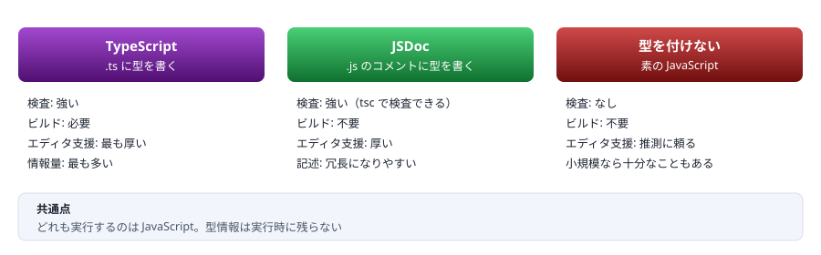

# 01. 背景

TypeScript は何を解決したのか ／ 型は実行時に消える

> 📅 作成: 2026-08-28 / 更新: 2026-08-29

[02. 実行環境](02-実行環境.md) [資料トップへ戻る](../README.md)

## この章の到達点

- JavaScript の何が問題で TypeScript が生まれたのかを、自分の言葉で説明できる
- `tsc` が**何をして、何をしないのか**を説明できる
- Java・C# のコンパイルと決定的に違う点を1つ挙げられる

## この章の内容

1. [JavaScript の何が問題だったか](#1-011-javascript-の何が問題だったか)
2. [TypeScript は「検査して、型を消す」だけ](#2-012-typescript-は検査して型を消すだけ)
3. [Java・C# のコンパイルとの違い](#3-013-javac-のコンパイルとの違い)
4. [型を付ける他の選択肢](#4-014-型を付ける他の選択肢)

## 1. 01.1 JavaScript の何が問題だったか

### 実行するまで壊れていることが分からない

JavaScript には、書いた時点で間違いを教えてくれる仕組みがありません。次のコードは**エラーを出さずに動きます**。

```typescript
// JavaScript
function greet(user) {
	return `Hello, ${user.name}`;
}

console.log(greet({ namae: "Alice" }));   // "Hello, undefined"
```

`namae` は `name` の打ち間違いですが、JavaScript は存在しないプロパティを読んでも `undefined` を返すだけです。<strong>例外も出ず、それらしい文字列が出力されます。</strong>この出力を誰かが見つけるまで、間違いは残り続けます。

同じコードに型を付けると、実行する前に止まります。

```typescript
// TypeScript
type User = { name: string };

function greet(user: User) {
	return `Hello, ${user.name}`;
}

console.log(greet({ namae: "Alice" }));
//                  ~~~~
// error TS2353: Object literal may only specify known properties,
//               and 'namae' does not exist in type 'User'.
//
// 訳: オブジェクト リテラルは既知のプロパティのみ指定できます。
//     'namae' は型 'User' に存在しません。
```

> [!NOTE]
> **エラーメッセージは既定で英語です。**
> この資料では<strong>実際に出力される英語をそのまま載せ、日本語訳を添えます。</strong>訳は `tsc --locale ja` の出力に合わせてあります。エラー番号（`TS2353` など）で検索する場合、**英語のほうが情報が見つかります。**

### 問題は「間違えること」ではなく「気づけないこと」

どの言語でも打ち間違いはします。JavaScript に固有なのは、**間違いが実行時まで表面化せず、しかも実行しても例外にならない場合がある**ことです。

| ありがちな間違い | JavaScript での結果 | 気づけるか |
|---|---|---|
| プロパティ名の打ち間違い | `undefined` が返る | ❌ **気づけない** |
| 引数の数を間違える | 足りない引数は `undefined` | ❌ **気づけない** |
| 文字列と数値を取り違える | `"1" + 1` が `"11"` になる | ❌ **気づけない** |
| `null` のプロパティを読む | 実行時に例外 | ⚠️ **実行時のみ** |
| 関数名の打ち間違い | 実行時に例外 | ⚠️ **実行時のみ** |

上の3行は**テストを書いても見逃す可能性があります**。値が「それらしく」出てしまうためです。TypeScript が解決しようとしたのは、この「気づけなさ」です。

> [!NOTE]
> **Java・C# から来た人へ**
> この章の内容は「型がないとこうなる」という当たり前の話に見えるはずです。<strong>読み飛ばして 01.2 へ進んで構いません。</strong>ただし、TypeScript の型が Java・C# の型と**まったく別の仕組みで動いている**ことは 01.2 と 01.3 で扱います。そこは飛ばさないでください。

## 2. 01.2 TypeScript は「検査して、型を消す」だけ

### tsc がやっていること

TypeScript のコンパイラ `tsc` がやることは、実質**次の2つだけ**です。

1. 型注釈をもとに**コードを検査する**
2. 型注釈を**取り除いた JavaScript を出力する**


図 1 — `tsc` は型を検査し、型を取り除いた JavaScript を出力する

### 出力を見ると分かる

次の `.ts` をコンパイルすると、

```typescript
// greet.ts
type User = { name: string; age: number };

export function greet(user: User): string {
	return `Hello, ${user.name}`;
}
```

出力される `.js` はこれだけです。

```typescript
// greet.js — 型に関する記述がすべて消えている
export function greet(user) {
	return `Hello, ${user.name}`;
}
```

`type User` の定義も、引数の `: User` も、戻り値の `: string` も残りません。**型は開発中にだけ存在する情報**です。

> [!IMPORTANT]
> **この一点が、以降のすべての章に効いてきます。**
> 型が実行時に消えるため、<strong>外から入ってくる値（JSON・環境変数・API のレスポンス）が型どおりである保証はどこにもありません。</strong>型を書いても、実行時の検証は別途必要です。この扱いは [11. 非同期とエラー処理](11-非同期とエラー処理.md) と [A3. 実務パターン集](A3-実務パターン集.md) で具体的に扱います。

### 型エラーがあっても .js は出力される

意外に思われる点ですが、**`tsc` は型エラーを報告しても JavaScript の出力は行います**（既定の設定の場合）。型検査と出力は独立した処理だからです。

```shell
$ npx tsc greet.ts
greet.ts:7:21 - error TS2353: Object literal may only specify known properties,
                              and 'namae' does not exist in type 'User'.

7 console.log(greet({ namae: "Alice" }));
                      ~~~~

Found 1 error in greet.ts:7

$ ls
greet.js  greet.ts     ← エラーがあっても .js は出力されている
```

止めたい場合は `noEmitOnError` を有効にします。設定の詳細は [03. tsconfig](03-tsconfig.md) で扱います。

### 動かしてみる

`tsx` を使うと、コンパイルの手順を意識せずに `.ts` をそのまま実行できます。

```typescript
// hello.ts
const name: string = "TypeScript";
console.log(`Hello, ${name}!`);
```

```shell
$ npx tsx hello.ts
Hello, TypeScript!
```

**Node型ストリップ** 新しい Node であれば、`tsx` を使わずそのまま実行することもできます。Node が型注釈を取り除いてから実行するためです。

```shell
$ node hello.ts
Hello, TypeScript!
```

どちらの方法にも制約と使い分けがあります。詳細は [02. 実行環境](02-実行環境.md) で扱います。

## 3. 01.3 Java・C# のコンパイルとの違い

### 「コンパイル」という同じ言葉が指すものが違う

Java や C# の経験がある読者ほど、ここで誤解が起きます。**どちらもコンパイルと呼びますが、出力されるものも、型情報の行き先も違います。**

| 観点 | Java ／ C# | TypeScript |
|---|---|---|
| 出力 | バイトコード ／ IL（人が読むものではない） | **JavaScript**（人が読める。元のコードとほぼ同じ形） |
| 型情報 | 実行時まで**残る** | 実行時には**残らない** |
| 型エラー時 | ビルドが失敗し、成果物ができない | エラーを報告するが、**出力はされる**（既定） |
| 型の判定基準 | 名前で判定する（名前的型付け） | **形で判定する**（構造的型付け → [05](05-構造的型付け.md)） |
| 実行するもの | JVM ／ CLR | JavaScript エンジン（Node・ブラウザ） |

> [!NOTE]
> **Java・C# から来た人へ**
> Java の `instanceof` や C# の `is` にあたる判定を、**TypeScript の `interface` に対しては書けません。**`interface` は実行時に存在しないためです。
> ```typescript
> interface User { name: string }
>
> // 書けない — User は実行時に存在しない
> // if (x instanceof User) { ... }
> //                ~~~~
> // error TS2693: 'User' only refers to a type, but is being used as a value here.
> //
> // 訳: 'User' は型のみを参照しますが、ここで値として使用されています。
> ```
> 実行時に「これは `User` か」を判定するには、**自分で判定コードを書きます**。その方法は [08. 型の絞り込み](08-型の絞り込み.md) で扱います。

### リフレクションに相当するものがない

Java の `getClass()`、C# の `typeof(T)` のように**実行時に型情報を取り出す仕組みは TypeScript にありません**。ジェネリクスの型引数も実行時には消えます（[09. ジェネリクス](09-ジェネリクス.md)）。

この制約は不便に見えますが、理由は単純です。**TypeScript は JavaScript に何も足さない**ためです。出力が普通の JavaScript である以上、JavaScript にない機能を実行時に持ち込むことはできません。

> [!NOTE]
> **「JavaScript に何も足さない」は設計方針です。**
> TypeScript は、実行時の挙動を変える機能を原則として追加しません。これにより、**既存の JavaScript をそのまま `.ts` にリネームしても動く**という性質が保たれ、段階的な導入が可能になっています。`enum` のように、この方針の例外にあたる機能もあります（[04. 型の基本](04-型の基本.md)）。

## 4. 01.4 型を付ける他の選択肢

### JavaScript に型を付ける方法は1つではない

「JavaScript は実行するまで間違いに気づけない」という問題への答えは、TypeScript だけではありません。



図 2 — 型を付ける3つの選択肢。検査の強さとビルドの要否が主な違い

### JSDoc という選択肢

`.js` のままコメントで型を書き、`tsc` に検査だけさせる方法です。**ビルドの手順が増えない**のが利点です。

```typescript
// greet.js — 拡張子は .js のまま
/**
 * @param {{ name: string }} user
 * @returns {string}
 */
function greet(user) {
	return `Hello, ${user.name}`;
}
```

| 選ぶ基準 | 向いている方 | 理由 |
|---|---|---|
| 新規のプロジェクト | **TypeScript** | 記述量が少なく、型の表現力も高い |
| ビルド手順を増やせない | **JSDoc** | `.js` のまま検査できる |
| 既存の大きな `.js` 資産がある | **JSDoc** から | ファイルを変換せず、1ファイルずつ型を足せる |
| 使い捨てのスクリプト | **型なし** | 型を書く手間が見合わない場合がある |

> [!NOTE]
> **この資料は TypeScript（`.ts`）を前提に進めます。**
> JSDoc で書く場合も、**型の考え方は同じ**です。書き方が違うだけなので、以降の章の内容はそのまま使えます。

### Flow について

かつて TypeScript と競合した型システムに Flow があります。現在の新規プロジェクトで選ぶ理由はほとんどありませんが、**古いコードで `// @flow` というコメントを見かけたら Flow のコード**だと判断できれば十分です。

**まとめ**

| 項目 | この章の結論 |
|---|---|
| 解決したい問題 | JavaScript は間違いに**実行時まで気づけない**。しかも例外にならず、それらしい値が出てしまう |
| `tsc` の仕事 | 型を検査することと、**型を取り除いた JavaScript を出力すること**の2つだけ |
| 型の寿命 | 開発中のみ。**実行時には残らない** |
| Java・C# との違い | 出力が JavaScript であること、型情報が実行時に消えること、型エラーでも出力されること |
| 他の選択肢 | JSDoc なら `.js` のまま検査できる。型の考え方は同じ |

**次は [02. 実行環境](02-実行環境.md) です。**`tsc`・`tsx`・Node の型ストリップの違いを押さえ、**手元で `.ts` が動く状態**を作ります。

[02. 実行環境](02-実行環境.md)

[資料トップへ戻る](../README.md)
