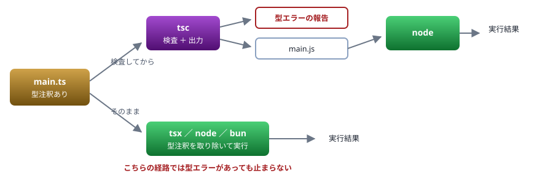
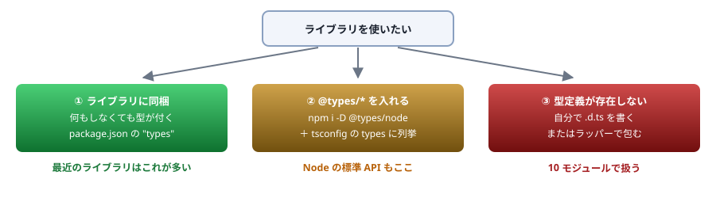

# 02. 実行環境

検査する道具と、実行する道具は別 ／ 手元で `.ts` が動く状態を作る

> 📅 作成: 2026-08-29 / 更新: 2026-08-29

[01. 背景](01-背景.md) [03. tsconfig](03-tsconfig.md) [資料トップへ戻る](../README.md)

## この章の到達点

- `tsc`・`tsx`・`node` の**役割の違い**を説明できる
- 手元で `.ts` を実行し、型エラーを表示できる状態を作れる
- 型定義（`@types`）がどこから来るのかを説明できる

## この章の内容

1. [動かす方法は4つある](#1-021-動かす方法は4つある)
2. [tsc — 検査する道具](#2-022-tsc--検査する道具)
3. [その場で実行する — tsx・node・bun・deno](#3-023-その場で実行する--tsxnodebundeno)
4. [npm と型定義（@types）](#4-024-npm-と型定義types)
5. [エディタと言語サーバ](#5-025-エディタと言語サーバ)

## 1. 02.1 動かす方法は4つある

### 「検査する」と「実行する」は別の仕事

[01. 背景](01-背景.md)で見たとおり、`tsc` の仕事は**型を検査すること**と**型を取り除いた JavaScript を出力すること**の2つでした。実行はしません。

一方、手元で動かすだけなら `tsc` を通さない道具もあります。<strong>それらは型を検査しません。</strong>型注釈を捨てて実行するだけです。

| 道具 | 型を検査する | 実行する | 使いどころ |
|---|---|---|---|
| `tsc` | ✅ **する** | ❌ **しない** | 検査と、配布用 JavaScript の生成 |
| `tsx` | ❌ **しない** | ✅ **する** | 開発中にすぐ動かす。制約が少ない |
| `node` | ❌ **しない** | ✅ **する** | 道具を増やさず動かす。**使えない構文がある** |
| `bun` / `deno` | ❌ **しない** ／一部する | ✅ **する** | Node 以外の処理系を使う場合 |

> [!IMPORTANT]
> **実行できたことは、型が正しいことを意味しません。**
> `tsx` も `node` も型注釈を**捨てるだけ**で、内容を見ていません。型エラーがあっても平然と動きます。<strong>検査は `tsc` かエディタが行います。</strong>この分担を混同すると、「動いているのにビルドが通らない」という状況の理由が分からなくなります。



図 1 — 検査する経路と、そのまま実行する経路。`tsx`・`node` は型を見ない

### この資料での使い分け

| 場面 | 使うもの |
|---|---|
| コード例を動かす | `npx tsx ファイル名.ts` |
| 型エラーを確かめる | `npx tsc --noEmit`、またはエディタの波線 |
| 出力される JavaScript を見る | `npx tsc` |

### コード例は実ファイルで用意してあります

この資料に出てくるコード例は、`docs/samples/` に実ファイルとして置いてあります。**写経せずに動かしたい場合はこちらを使ってください。**

```shell
$ cd docs/samples
$ npm i

$ npx tsx 04-null-check.ts    # 個別に実行する
$ npx tsc                     # 全ファイルをまとめて型検査する
```

ファイル名は `04-null-check.ts` のように**資料番号が接頭辞**になっています。読んでいる章に対応するファイルがすぐ見つかります。

## 2. 02.2 tsc — 検査する道具

### 導入する

プロジェクトごとに入れます。グローバルに入れると、プロジェクトごとにバージョンを変えられません。

```shell
$ npm init -y
$ npm i -D typescript tsx

$ npx tsc --version
Version 7.0.2
```

### 検査だけする — --noEmit

`tsc` は既定で JavaScript を出力します。**検査だけしたいときは `--noEmit`** を付けます。

```shell
$ npx tsc --noEmit greet.ts
greet.ts:7:21 - error TS2353: Object literal may only specify known properties,
                              and 'namae' does not exist in type 'User'.

7 console.log(greet({ namae: "Alice" }));
                      ~~~~

Found 1 error in greet.ts:7
```

エラーがなければ**何も出力しません**。「何も出ない = 合格」です。

### 設定ファイルとコマンドライン引数は併用できない

**TS7** `tsconfig.json` がある状態でコマンドラインにファイル名を指定すると、<strong>`tsconfig.json` は読み込まれません。</strong>TypeScript 7 はこれをエラーで教えてくれます。

```shell
$ npx tsc --noEmit fs-test.ts
error TS5112: tsconfig.json is present but will not be loaded if files are
              specified on commandline. Use '--ignoreConfig' to skip this error.

訳: tsconfig.json がありますが、コマンドラインでファイルを指定すると読み込まれません。
    このエラーを飛ばすには '--ignoreConfig' を使ってください。
```

> [!IMPORTANT]
> **この挙動は TypeScript 5 系でも同じですが、警告が出ません。**
> 5 系では黙って `tsconfig.json` を無視するため、<strong>「設定したはずのオプションが効かない」</strong>という形で現れます。プロジェクト全体を検査するときは、**ファイル名を指定せず `npx tsc` だけ**を実行してください。

### 設定を作る

`tsconfig.json` の雛形は次のコマンドで作れます。中身は [03. tsconfig](03-tsconfig.md) で扱います。

```shell
$ npx tsc --init
```

## 3. 02.3 その場で実行する — tsx・node・bun・deno

### tsx — 制約が少ない

`tsx` は型注釈を取り除いて実行します。**この資料のコード例はすべて `tsx` で動きます。**

```shell
$ npx tsx hello.ts
Hello, TypeScript!
```

### node — 道具を増やさずに動かす

**Node型ストリップ** 新しい Node は `.ts` をそのまま実行できます。型注釈を取り除いてから実行する仕組み（type stripping）が入っているためです。

```shell
$ node --version
v26.8.1

$ node hello.ts
Hello, TypeScript!
```

#### 使えない構文がある

Node の型ストリップは<strong>「取り除く」だけで、変換はしません。</strong>そのため、**JavaScript のコードを生成する必要がある構文は使えません。**

```typescript
// enum-test.ts
enum Color { Red, Green, Blue }
const c: Color = Color.Green;
console.log(Color[c]);
```

```shell
$ node enum-test.ts
SyntaxError [ERR_UNSUPPORTED_TYPESCRIPT_SYNTAX]:
  TypeScript enum is not supported in strip-only mode

訳: TypeScript の enum は、取り除くだけのモードでは対応していません。
```

`enum` は型ではなく**実行時のオブジェクトを生成する**ため、取り除くだけでは成立しません。同じ理由で、クラスの**パラメータプロパティ**も使えません。

```typescript
// param-prop.ts
class User {
	constructor(public name: string) {}   // ← public が代入コードを生む
}
```

```shell
$ node param-prop.ts
SyntaxError [ERR_UNSUPPORTED_TYPESCRIPT_SYNTAX]:
  TypeScript parameter property is not supported in strip-only mode

訳: TypeScript のパラメータプロパティは、取り除くだけのモードでは対応していません。
```

| 構文 | node | tsx | 理由 |
|---|---|---|---|
| 型注釈・`interface`・`type` | ✅ **使える** | ✅ **使える** | 取り除くだけで済む |
| `enum` | ❌ **使えない** | ✅ **使える** | 実行時のオブジェクトを生成する |
| パラメータプロパティ | ❌ **使えない** | ✅ **使える** | 代入コードを生成する |
| `namespace` | ❌ **使えない** | ✅ **使える** | 同上 |

> [!NOTE]
> **この制約は、むしろ推奨される書き方に沿っています。**
> `enum` と `namespace` は「JavaScript に何も足さない」という TypeScript の設計方針の例外にあたる機能で、現在は使用を避けるのが一般的です。`enum` の代わりに何を使うかは [04. 型の基本](04-型の基本.md) で扱います。

### bun と deno

Node 以外の処理系も `.ts` をそのまま実行できます。

```shell
$ bun --version
1.4.0
$ bun run hello.ts
Hello, TypeScript!

$ deno --version
deno 1.31.1 (release, x86_64-pc-windows-msvc)
$ deno run hello.ts
Hello, TypeScript!
```

`bun` は `enum` も実行できます（取り除くだけでなく変換するため）。**この資料は Node を前提に進めますが、コード例は bun・deno でもそのまま動きます。**

## 4. 02.4 npm と型定義（@types）

### 型定義はライブラリとは別に配られることがある

JavaScript のライブラリには型がありません。TypeScript から使うには<strong>型定義ファイル（`.d.ts`）</strong>が必要です。

| 型定義の在り処 | 説明 | 例 |
|---|---|---|
| ライブラリに同梱 | 何もしなくても型が付く。最近のライブラリはこれが多い | `zod`、`hono` |
| `@types/*` | 有志が書いた型定義を別途入れる（DefinitelyTyped） | `@types/node`、`@types/express` |
| 存在しない | 自分で書くか、`unknown` で受ける（[10](10-モジュールと宣言ファイル.md)） | 古いライブラリ |



図 2 — 型定義の入手経路は3つ。どれに当たるかで対処が変わる

### Node の標準 API にも型定義が要る

`node:fs` のような標準モジュールも、**型定義は別途入れます**。入れないとこうなります。

```typescript
// fs-test.ts
import { readFileSync } from "node:fs";
const s = readFileSync("package.json", "utf8");
```

```shell
$ npx tsc
fs-test.ts(1,30): error TS2591: Cannot find name 'node:fs'.
  Do you need to install type definitions for node?
  Try `npm i --save-dev @types/node` and then add 'node' to the types field in your tsconfig.

訳: 'node:fs' という名前が見つかりません。node の型定義を入れる必要がありますか。
    `npm i --save-dev @types/node` を実行し、tsconfig の types に 'node' を追加してください。
```

```shell
$ npm i -D @types/node
```

### TypeScript 7 では types への明示が必要

**TS7** **`@types/node` を入れるだけでは足りません。**`tsconfig.json` の `types` に `"node"` を書く必要があります。

```json
{
	"compilerOptions": {
		"target": "es2022",
		"module": "nodenext",
		"moduleResolution": "nodenext",
		"strict": true,
		"types": ["node"]        // ← TypeScript 7 では必須
	}
}
```

> [!IMPORTANT]
> **TypeScript 5 系では `types` を書かなくても通ります。**
> 5 系は `node_modules/@types/` 配下を**自動で読み込んで**いました。7 では明示が必要です。<strong>「5 では通っていたコードが 7 で TS2591 になる」</strong>のはこれが原因です。エラーメッセージ自身が `types` への追加を促しているので、指示どおりに直せば解決します。

### devDependencies に入れる

型定義は**開発中にしか使いません**（実行時には消えているため）。`-D`（`--save-dev`）で入れます。

```shell
$ npm i -D typescript tsx @types/node
```

## 5. 02.5 エディタと言語サーバ

### 波線を出しているのは tsc ではない

エディタが型エラーを波線で示すのは、<strong>TypeScript の言語サーバ（tsserver）</strong>が裏で動いているためです。`tsc` とは別のプロセスですが、**同じ TypeScript のコード**を使っています。

### エディタとコマンドラインで結果が違うとき

「エディタは赤いのに `tsc` は通る」「その逆」が起きたら、**ほぼ確実にバージョンか設定の食い違い**です。

| 症状 | 疑うところ |
|---|---|
| エディタだけエラーが出る／出ない | **エディタが使っている TypeScript のバージョン**。VS Code は既定で同梱版を使う。プロジェクトの版に切り替える |
| 特定のファイルだけ型が付かない | `tsconfig.json` の `include` / `exclude` から漏れている |
| 設定を変えても反映されない | 言語サーバの再起動が必要（VS Code: `TypeScript: Restart TS Server`） |
| コマンドラインだけエラーが出る | ファイル名を指定して `tsconfig.json` が無視されている（**02.2**） |

> [!TIP]
> **VS Code のバージョンをプロジェクトのものに合わせます。**
> `.ts` を開いた状態で、コマンドパレットから `TypeScript: Select TypeScript Version` →「Use Workspace Version」を選びます。これをしないと、**チーム内で人によってエラーの出方が変わります**。

### 動作確認の3点

この先の章を読む前に、次の3つが通ることを確かめてください。

```shell
$ node --version                    # LTS 以降であること
$ npx tsx --version                 # 実行できること
$ npx tsc --noEmit                  # 検査が動くこと
```

エディタで `.ts` を開き、わざと `const n: number = "文字列";` と書いて**波線が出ること**も確認してください。出なければ、この先のコード例で「エラーになるはず」の箇所が確認できません。

**まとめ**

| 項目 | この章の結論 |
|---|---|
| 検査と実行 | **別の道具が担当する。**`tsx`・`node` は型を見ずに実行する |
| `tsc` | 検査だけなら `--noEmit`。**ファイル名を指定すると `tsconfig.json` が無視される** |
| `node` の型ストリップ | 取り除くだけ。`enum`・パラメータプロパティ・`namespace` は使えない |
| 型定義 | ライブラリ同梱か `@types/*`。**TypeScript 7 では `types` への明示が要る** |
| エディタ | 言語サーバが検査している。**バージョンをプロジェクトに合わせる** |

<strong>次は [03. tsconfig](03-tsconfig.md) です。</strong>この章で作った `tsconfig.json` の中身を読み解きます。**読者が最も詰まる章**です。

[01. 背景](01-背景.md)

[03. tsconfig](03-tsconfig.md)

[資料トップへ戻る](../README.md)
