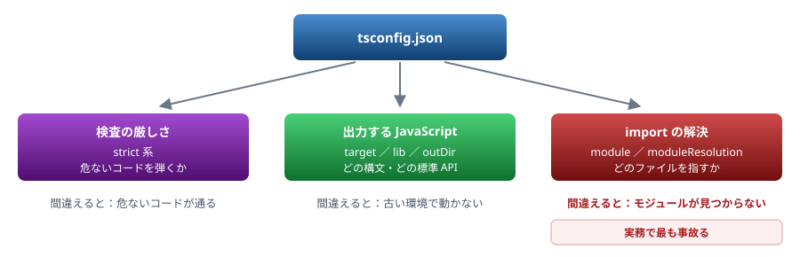

# 03. tsconfig

検査の厳しさ・出力する JavaScript・`import` の解決を決める

> 📅 作成: 2026-08-29 / 更新: 2026-08-29

[02. 実行環境](02-実行環境.md) [04. 型の基本](04-型の基本.md) [資料トップへ戻る](../README.md)

## この章の到達点

- `strict` が何を有効にするのか、**無効だと何が通ってしまうのか**を説明できる
- `target`・`module`・`moduleResolution` の役割を区別できる
- 設定を変えてもエラーが変わらないときに、原因を切り分けられる

## この章の内容

1. [tsconfig.json は3つのことを決める](#1-031-tsconfigjson-は3つのことを決める)
2. [strict — 何を防いでいるか](#2-032-strict--何を防いでいるか)
3. [target と lib — どの JavaScript を出すか](#3-033-target-と-lib--どの-javascript-を出すか)
4. [module と moduleResolution — import の解決](#4-034-module-と-moduleresolution--import-の解決)

## 1. 03.1 tsconfig.json は3つのことを決める

### 設定項目は多いが、決めていることは少ない

`tsc --init` が生成する `tsconfig.json` には数十の項目が並びます。しかし**決めていることは大きく3つ**です。

| 何を決めるか | 主な項目 | 間違えるとどうなるか |
|---|---|---|
| **検査の厳しさ** | `strict` 系 | 危ないコードが通る。`null` 由来の実行時エラーが残る |
| **出力する JavaScript** | `target`・`lib`・`outDir` | 古い環境で動かない。新しい API が「存在しない」と言われる |
| **`import` の解決** | `module`・`moduleResolution` | <strong>モジュールが見つからない。</strong>実務で最も事故る |



図 1 — `tsconfig.json` が決める3つのこと。設定項目は多いが、決めていることは少ない

### 最小の設定

Node で動かす前提なら、まずこれで足ります。

```json
{
	"compilerOptions": {
		"target": "es2022",
		"module": "nodenext",
		"moduleResolution": "nodenext",
		"strict": true,
		"types": ["node"],
		"outDir": "dist"
	},
	"include": ["src/**/*.ts"]
}
```

> [!IMPORTANT]
> **設定を変えてもエラーが変わらないときは、設定が読まれていないことを疑ってください。**
> [02. 実行環境](02-実行環境.md)で見たとおり、<strong>コマンドラインにファイル名を指定すると `tsconfig.json` は無視されます。</strong>プロジェクト全体を検査するときは `npx tsc` だけを実行します。

### include と exclude

| 項目 | 意味 |
|---|---|
| `include` | 検査の対象。省略すると設定ファイルのある場所以下すべて |
| `exclude` | `include` から除く。既定で `node_modules` が入っている |
| `files` | 個別に列挙する。ファイル数が少ないときだけ |

**「特定のファイルだけ型が付かない」ときは、まず `include` から漏れていないかを見ます。**

## 2. 03.2 strict — 何を防いでいるか

### TypeScript 7 では既定で有効になった

**TS7** <strong>TypeScript 7 は `strict` が既定で `true` です。</strong>5 系は既定で `false` でした。

```typescript
// strict-test.ts
function greet(name) {
	return "Hello, " + name.toUpperCase();
}
const u: { name?: string } = {};
console.log(u.name.length);
```

| バージョン | 設定なしで実行 | 結果 |
|---|---|---|
| TypeScript 7.0.2 | `npx tsc --noEmit` | ❌ **エラー2件** `TS7006` と `TS18048` |
| TypeScript 5.9.3 | `npx tsc --noEmit` | ✅ **エラーなし** 素通りする |

> [!IMPORTANT]
> **「5 では通っていたコードが 7 でエラーになる」原因の多くがこれです。**
> 移行時に大量のエラーが出ても、コードが急に壊れたわけではありません。**今まで見逃されていた問題が表示されるようになっただけ**です。一時的に `"strict": false` にして段階的に直す手もありますが、**新規プロジェクトでは必ず有効にしてください。**

### strict が有効にする主な項目

| 項目 | 防いでいること | エラー番号 |
|---|---|---|
| `noImplicitAny` | 型を書き忘れた引数が暗黙に `any` になること。**1か所の `any` が下流の検査を無効化する**（[06](06-any-unknown-アサーション.md)） | `TS7006` |
| `strictNullChecks` | `null`・`undefined` を素通りさせること。**最も効果が大きい** | `TS18048`<br>`TS2531` |
| `strictFunctionTypes` | 関数の引数の型が緩く扱われること（反変チェック） | `TS2345` |
| `strictPropertyInitialization` | クラスのプロパティが初期化されないまま使われること | `TS2564` |
| `useUnknownInCatchVariables` | `catch (e)` の `e` が `any` になること（[11](11-非同期とエラー処理.md)） | `TS18046` |

#### 実際のエラー

```shell
$ npx tsc --noEmit
strict-test.ts(1,16): error TS7006: Parameter 'name' implicitly has an 'any' type.
strict-test.ts(5,13): error TS18048: 'u.name' is possibly 'undefined'.

訳: 引数 'name' は暗黙的に 'any' 型になっています。
    'u.name' は 'undefined' の可能性があります。
```

### 個別に切る場合

`strict: true` のまま、特定の項目だけ切ることもできます。**順序が重要で、`strict` の後に書いた項目が勝ちます。**

```json
{
	"compilerOptions": {
		"strict": true,
		"strictPropertyInitialization": false   // ← strict の後なのでこちらが有効
	}
}
```

> [!NOTE]
> **Java・C# から来た人へ**
> `strictNullChecks` が有効な TypeScript の `string` は、<strong>`null` を代入できません。</strong>Java の `String` や C# の参照型（null 許容が既定の場合）とは違います。
> ```typescript
> let s: string = null;         // エラー TS2322
> let t: string | null = null;  // これなら通る
> ```
> C# の nullable 参照型（`string?`）に近い考え方です。**「null かもしれない」ことを型で示さないと、null を入れられません。**

## 3. 03.3 target と lib — どの JavaScript を出すか

### target — 出力する構文のレベル

`target` は**出力する JavaScript の文法レベル**を決めます。古い値にすると、新しい構文が古い書き方に変換されます。

| target | 出力される `const x = a ?? b;` |
|---|---|
| `es2022` | `const x = a ?? b;`（そのまま） |
| `es5` | `var x = a !== null && a !== void 0 ? a : b;`（変換される） |

<strong>Node で動かすなら `es2022` 以上で構いません。</strong>古い値にする理由は、古いブラウザを相手にする場合だけです。

### lib — 使える標準 API

`lib` は**型として存在する標準 API**を決めます。`target` から自動で決まるため、通常は書きません。

| 症状 | 原因 |
|---|---|
| `Array.prototype.at` が「存在しない」と言われる | `lib` が古い（`at` は ES2022） |
| `document` や `window` が見つからない | `lib` に `DOM` が入っていない（Node 向け設定では正常） |
| ブラウザ向けなのに `document` が使えない | `"lib": ["es2022", "DOM"]` を明示する |

> [!IMPORTANT]
> **`lib` は「型があるか」だけを決めます。実行時に動くかは別問題です。**
> `lib` を新しくすれば型エラーは消えますが、<strong>古い実行環境で動く保証にはなりません。</strong>逆に、実行環境が新しくても `lib` が古ければ型エラーになります。**型と実行時は連動していません**（[01. 背景](01-背景.md)）。

## 4. 03.4 module と moduleResolution — import の解決

### 2つは役割が違う

| 項目 | 決めること |
|---|---|
| `module` | **出力する**モジュール形式（`import` のまま出すか `require` にするか） |
| `moduleResolution` | **探し方**。`import "./foo"` をどのファイルに対応させるか |

### Node 向けなら nodenext

**ESM** **CJS** Node で動かすなら、両方 `nodenext` にするのが確実です。**`package.json` の `"type"` を見て、ESM と CJS を自動で切り替えます。**

```json
{
	"compilerOptions": {
		"module": "nodenext",
		"moduleResolution": "nodenext"
	}
}
```

| 用途 | module | moduleResolution |
|---|---|---|
| Node で実行する | `nodenext` | `nodenext` |
| Vite・webpack 等で束ねる | `esnext` | `bundler` |
| 古い CommonJS プロジェクト | `commonjs` | `node10` |

### paths は実行時には効かない

`paths` でインポートの別名を作れますが、**これは型検査だけの機能です。**

```json
{
	"compilerOptions": {
		"baseUrl": ".",
		"paths": { "@/*": ["src/*"] }
	}
}
```

```typescript
import { greet } from "@/greet";   // tsc は解決できる
                                   // node は解決できない
```

> [!WARNING]
> **`paths` を使うなら、実行側にも同じ設定が要ります。**
> `tsc` が出力する JavaScript には `@/greet` がそのまま残ります。<strong>Node はこれを解決できません。</strong>バンドラを使うか、`package.json` の `imports` フィールドを使うか、そもそも `paths` を使わないかを選びます。「型は通るのに実行時に落ちる」典型例です。

### 設定が合っているかの確かめ方

```shell
$ npx tsc --showConfig      # 実際に使われる設定を展開して表示する
```

**継承（`extends`）や既定値を含めた最終的な設定**が出ます。「書いたはずの設定が効かない」ときは、これで実際の値を確認します。

**まとめ**

| 項目 | この章の結論 |
|---|---|
| 決めていること | 検査の厳しさ・出力する JavaScript・`import` の解決の3つ |
| `strict` | <strong>TypeScript 7 では既定で有効。</strong>5 系では無効。移行時のエラー増加の主因 |
| `target`・`lib` | Node なら `es2022` 以上。`lib` は型の有無だけを決め、実行可否とは無関係 |
| `module` 系 | Node なら両方 `nodenext`。`paths` は**実行時には効かない** |
| 確認方法 | `npx tsc --showConfig` で実際に使われる設定を見る |

<strong>次は [04. 型の基本](04-型の基本.md) です。</strong>ここから型そのものの話に入ります。**04 と 05 は飛ばさないでください。**

[02. 実行環境](02-実行環境.md)

[04. 型の基本](04-型の基本.md)

[資料トップへ戻る](../README.md)
