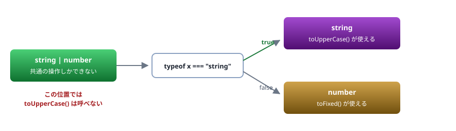

# 04. 型の基本

プリミティブ・配列・オブジェクト・union ／ `type` と `interface` の使い分け

> 📅 作成: 2026-08-29 / 更新: 2026-08-29

[03. tsconfig](03-tsconfig.md) [05. 構造的型付け](05-構造的型付け.md) [資料トップへ戻る](../README.md)

## この章の到達点

- 変数・引数・戻り値に型を書ける
- **union 型とリテラル型**で「取りうる値」を表現できる
- `type` と `interface` のどちらを使うか判断できる

## この章の内容

1. [プリミティブと配列](#1-041-プリミティブと配列)
2. [オブジェクトの型](#2-042-オブジェクトの型)
3. [union 型とリテラル型](#3-043-union-型とリテラル型)
4. [type と interface](#4-044-type-と-interface)
5. [null と undefined](#5-045-null-と-undefined)

## 1. 04.1 プリミティブと配列

### 書き方は「変数名のうしろにコロン」

```typescript
// JavaScript
let name = "Alice";
let age = 30;

// TypeScript
let name: string = "Alice";
let age: number = 30;
```

| 型 | 値の例 | Java / C# との違い |
|---|---|---|
| `string` | `"Alice"`、``Hello, ${name}`` | `char` はない。1文字も `string` |
| `number` | `30`、`3.14`、`-1` | <strong>`int` と `double` の区別がない。</strong>すべて64ビット浮動小数点 |
| `boolean` | `true`、`false` | 同じ |
| `bigint` | `10n` | Java の `BigInteger` に近い。リテラルに `n` が付く |
| `symbol` | `Symbol("id")` | 相当するものがない。一意なキーを作る |

> [!NOTE]
> **型を書かなくても型は付きます。**
> `let name = "Alice";` と書けば、TypeScript は `name` を `string` と**推論**します。冗長に書く必要はありません。**書くべきなのは、推論に任せると意図と違う型になる場所**です。

### 配列

```typescript
const names: string[] = ["Alice", "Bob"];
const ages: Array<number> = [30, 25];      // 同じ意味。string[] のほうが一般的

const pairs: [string, number] = ["Alice", 30];   // タプル（要素数と型が固定）
```

> [!NOTE]
> **Java・C# から来た人へ**
> TypeScript の配列は**長さが可変**で、Java の `ArrayList`、C# の `List<T>` に相当します。`string[]` という記法は Java・C# の配列と同じ見た目ですが、**固定長ではありません。**
> 要素数を固定したいときは**タプル**を使います。`[string, number]` は「1つ目が `string`、2つ目が `number` の2要素」を意味します。

### 読み取り専用にする

```typescript
const names: readonly string[] = ["Alice", "Bob"];
names.push("Carol");
//    ~~~~
// error TS2339: Property 'push' does not exist on type 'readonly string[]'.
//
// 訳: プロパティ 'push' は型 'readonly string[]' に存在しません。
```

`const` は**再代入**を防ぐだけで、中身の変更は防ぎません。**中身を変えられたくないときは `readonly`** を使います。

## 2. 04.2 オブジェクトの型

### 形をそのまま書く

```typescript
// JavaScript
const user = { name: "Alice", age: 30 };

// TypeScript — 型を別に定義する
type User = {
	name: string;
	age: number;
};

const user: User = { name: "Alice", age: 30 };
```

### 省略可能なプロパティ

```typescript
type User = {
	name: string;
	age?: number;        // あってもなくてもよい
};

const a: User = { name: "Alice" };              // OK
const b: User = { name: "Bob", age: 25 };       // OK
```

`age?: number` は `age: number | undefined` とほぼ同じですが、<strong>`?` は「キー自体がなくてもよい」</strong>点が違います。

| 書き方 | キーを省略 | undefined を代入 |
|---|---|---|
| `age?: number` | ✅ **できる** | ✅ **できる** |
| `age: number \| undefined` | ❌ **できない** | ✅ **できる** |

### readonly なプロパティ

```typescript
type Config = {
	readonly host: string;
	readonly port: number;
};

const c: Config = { host: "localhost", port: 3000 };
c.port = 8080;
// ~~~~~~
// error TS2540: Cannot assign to 'port' because it is a read-only property.
//
// 訳: 'port' は読み取り専用プロパティのため、代入できません。
```

### インデックスシグネチャ

キーが決まっていないオブジェクトを表します。

```typescript
type Counts = { [key: string]: number };

const c: Counts = { apple: 3, banana: 5 };
c.orange = 2;                     // 任意のキーを足せる
```

> [!IMPORTANT]
> **インデックスシグネチャは検査を弱めます。**
> どんなキーでも許されるため、<strong>打ち間違いを検出できません。</strong>キーが決まっているなら列挙し、決まっていないなら `Map` を使うか、`Record<string, number>`（[A4](A4-型レベルプログラミング.md)）を検討してください。

## 3. 04.3 union 型とリテラル型

### TypeScript で最もよく使う道具

**union 型**は「いずれか」を表します。縦棒で並べます。

```typescript
let id: string | number;
id = "abc";     // OK
id = 123;       // OK
id = true;      // エラー TS2322
```

### リテラル型 — 「この値だけ」

型の位置に**値そのもの**を書けます。union と組み合わせると強力です。

```typescript
type Status = "pending" | "active" | "closed";

let s: Status = "active";      // OK
s = "activ";                   // エラー（打ち間違いを検出できる）
//  ~
// error TS2322: Type '"activ"' is not assignable to type 'Status'.
//
// 訳: 型 '"activ"' を型 'Status' に割り当てることはできません。
```

> [!NOTE]
> **Java・C# から来た人へ — これが `enum` の代わりです**
> Java の `enum`、C# の `enum` に相当する用途は、TypeScript では**文字列リテラルの union** で書くのが主流です。
> ```typescript
> // TypeScript にも enum はあるが、使わないことが多い
> enum Status { Pending, Active, Closed }
>
> // こちらが推奨
> type Status = "pending" | "active" | "closed";
> ```
> 理由は3つあります。**①実行時のコードを生成しない**（型だけで完結する）、**②値がそのまま文字列なのでログや JSON でそのまま読める**、**③[Node の型ストリップ](02-実行環境.md)で `enum` は使えない**。

### as const — リテラル型として固定する

```typescript
let s1 = "active";                    // 型は string（後で別の文字列を入れられる）
const s2 = "active";                  // 型は "active"（const なので変わらない）

const arr1 = ["a", "b"];              // 型は string[]
const arr2 = ["a", "b"] as const;     // 型は readonly ["a", "b"]
```

`as const` は<strong>「この値のまま固定する」</strong>指示です。設定オブジェクトを定義するときによく使います。

```typescript
const CONFIG = {
	host: "localhost",
	port: 3000,
} as const;

// CONFIG.host の型は "localhost"（string ではない）
// CONFIG.port = 8080;   ← エラー。readonly になる
```

### union は「絞り込んで」使う

union のままでは、共通して持つ操作しかできません。

```typescript
function show(id: string | number) {
	console.log(id.toUpperCase());
	//             ~~~~~~~~~~~
	// error TS2339: Property 'toUpperCase' does not exist on type 'string | number'.
	//
	// 訳: プロパティ 'toUpperCase' は型 'string | number' に存在しません。
}
```



図 1 — union はそのままでは使えない。確かめると、その分岐の中では確定した型になる

<strong>どちらなのかを確かめてから使います。</strong>この操作を<strong>絞り込み（narrowing）</strong>と呼び、[08. 型の絞り込み](08-型の絞り込み.md)で詳しく扱います。

```typescript
function show(id: string | number) {
	if (typeof id === "string") {
		console.log(id.toUpperCase());   // ここでは string として扱える
	} else {
		console.log(id.toFixed(2));      // ここでは number
	}
}
```

## 4. 04.4 type と interface

### どちらでもオブジェクトの形を書ける

```typescript
type UserA = {
	name: string;
	age: number;
};

interface UserB {
	name: string;
	age: number;
}
```

<strong>この2つはほぼ同じです。</strong>相互に代入でき、どちらも構造的型付け（[05](05-構造的型付け.md)）で判定されます。

### 違いは3つだけ

| 項目 | `type` | `interface` |
|---|---|---|
| union を作れる | ✅ **できる** | ❌ **できない** |
| 同名で再宣言 | ❌ **エラー** | ⚠️ **合体する** |
| プリミティブに別名 | ✅ **できる** | ❌ **できない** |

```typescript
// type にしかできないこと
type Status = "pending" | "active";     // union
type ID = string;                       // プリミティブの別名

// interface にしかできないこと — 同名の宣言が合体する（宣言のマージ）
interface Window { myApp: string; }     // 既存の Window に足す
```

> [!TIP]
> **迷ったら `type` を使ってください。**
> union やタプルを扱えるぶん `type` のほうが用途が広く、**意図せず合体することもありません。**`interface` が要るのは、外部ライブラリの型を拡張する（宣言のマージ）場合です。
> ただし<strong>プロジェクト内で統一されているなら、そちらに合わせてください。</strong>混在しているほうが読みにくくなります。

> [!NOTE]
> **Java・C# から来た人へ**
> TypeScript の `interface` は、Java・C# の `interface` とは別物です。
> - **`implements` を書かなくても、形が合っていれば互換**になります（[05. 構造的型付け](05-構造的型付け.md)）
> - **実行時には存在しません。**`x instanceof User` と書けません（[01. 背景](01-背景.md)）
> - データの形を表すために使われ、「実装すべき契約」という意味合いは弱くなります

### 組み合わせる

```typescript
type Base = { id: string };
type Timestamps = { createdAt: Date };

type Entity = Base & Timestamps;        // 交差型（両方の性質を持つ）

const e: Entity = { id: "1", createdAt: new Date() };
```

`interface` では `extends` を使います。

```typescript
interface Entity extends Base, Timestamps {}
```

## 5. 04.5 null と undefined

### 2つある

| 値 | 意味 | いつ現れるか |
|---|---|---|
| `undefined` | 「まだ入っていない」 | 初期化していない変数、存在しないプロパティ、戻り値のない関数 |
| `null` | 「意図的に空」 | 明示的に代入したとき、一部の API の戻り値 |

> [!TIP]
> **実務では `undefined` に寄せるのが一般的です。**
> JavaScript の言語機能（省略可能引数、分割代入の既定値、`?.`）が `undefined` を前提にしているためです。**`null` は外部から来たとき（JSON・DB・API）だけ扱う**と決めておくと、判定が減ります。

### strictNullChecks があると代入できない

**strict** [03. tsconfig](03-tsconfig.md) で見たとおり、`strict` が有効だと `null` を勝手に入れられません。

```typescript
let s: string = null;
//  ~
// error TS2322: Type 'null' is not assignable to type 'string'.
//
// 訳: 型 'null' を型 'string' に割り当てることはできません。

let t: string | null = null;      // これなら通る
```

### 安全に扱う3つの記法

```typescript
type User = { name: string; profile?: { bio: string } };

function show(u: User) {
	// ① オプショナルチェーン — undefined なら undefined を返す
	console.log(u.profile?.bio);

	// ② null 合体演算子 — null / undefined のときだけ既定値
	console.log(u.profile?.bio ?? "（未設定）");

	// ③ 絞り込み — if で確かめる
	if (u.profile) {
		console.log(u.profile.bio);      // ここでは確実にある
	}
}
```

> [!WARNING]
> **`??` と `||` は違います。**
> `||` は `0` や `""` も「偽」として既定値に置き換えてしまいます。**`??` は `null` と `undefined` のときだけ**働きます。
> ```typescript
> const port1 = 0 || 3000;     // 3000 になる（0 が消える）
> const port2 = 0 ?? 3000;     // 0 のまま
> ```
> **設定値を扱うときは `??` を使ってください。**「0 を指定したのに既定値になる」という不具合の原因になります。

### 動かしてみる

```typescript
// null-check.ts
type User = { name: string; age?: number };

function describe(u: User): string {
	return `${u.name} (${u.age ?? "年齢不明"})`;
}

console.log(describe({ name: "Alice", age: 30 }));
console.log(describe({ name: "Bob" }));
```

```shell
$ npx tsx null-check.ts
Alice (30)
Bob (年齢不明)
```

**まとめ**

| 項目 | この章の結論 |
|---|---|
| 基本型 | `number` に `int`／`double` の区別はない。`readonly` で中身を守る |
| オブジェクト | `?` は「キーがなくてもよい」。インデックスシグネチャは検査を弱める |
| union・リテラル | **TypeScript で最もよく使う道具。**`enum` の代わりに文字列リテラルの union を使う |
| `type`／`interface` | ほぼ同じ。**迷ったら `type`**。`interface` は宣言のマージが要るときだけ |
| `null`／`undefined` | `undefined` に寄せる。`??` と `\|\|` を混同しない |

<strong>次は [05. 構造的型付け](05-構造的型付け.md) です。</strong>この資料の**山場のひとつ**で、Java・C# 経験者が最もつまずく箇所です。

[03. tsconfig](03-tsconfig.md)

[05. 構造的型付け](05-構造的型付け.md)

[資料トップへ戻る](../README.md)
