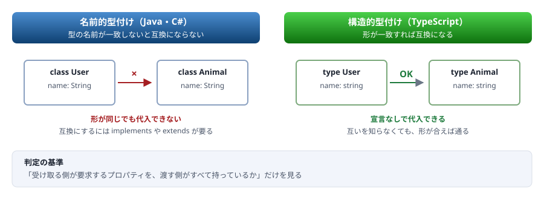
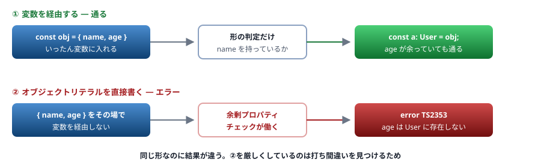

# 05. 構造的型付け

名前ではなく「形」で互換を判定する ／ この資料の山場①

> 📅 作成: 2026-08-29 / 更新: 2026-08-29

[04. 型の基本](04-型の基本.md) [06. any・unknown・型アサーション](06-any-unknown-アサーション.md) [資料トップへ戻る](../README.md)

## この章の到達点

- ある値が別の型に代入できるかどうかを、**形を見て**判断できる
- オブジェクトリテラルのときだけ厳しくなる理由（余剰プロパティチェック）を説明できる
- 形が同じでも**意図的に区別したい**ときの手段を持つ

## この章の内容

1. [形が同じなら同じ型として通る](#1-051-形が同じなら同じ型として通る)
2. [余剰プロパティチェック](#2-052-余剰プロパティチェック)
3. [クラスも形で判定される](#3-053-クラスも形で判定される)
4. [意図的に区別する — ブランド型](#4-054-意図的に区別する--ブランド型)

## 1. 05.1 形が同じなら同じ型として通る

### 名前は見ていない

TypeScript は<strong>型の名前を見ません。</strong>持っているプロパティの形だけを見ます。

```typescript
type User = { name: string };
type Animal = { name: string };

const a: User = { name: "Alice" };
const b: Animal = a;              // 通る。形が同じだから
```

`User` と `Animal` はまったく別の意図で作った型ですが、**形が同じなので互換**です。



図 1 — 名前で判定するか、形で判定するか

### 多い分には構わない

判定の基準は<strong>「受け取る側が要求するものを、渡す側が持っているか」</strong>です。余分に持っていても通ります。

```typescript
type Named = { name: string };

const user = { name: "Alice", age: 30, email: "a@example.com" };
const n: Named = user;            // 通る。name を持っているから
```

> [!NOTE]
> **Java・C# から来た人へ**
> これは Java・C# の<strong>名前的型付け（nominal typing）</strong>と根本的に違います。Java では、形が同じでも `implements` を書かなければ互換になりません。
> TypeScript が構造的型付けを採用しているのは、**JavaScript のコードに後から型を付けるため**です。既存の JavaScript は「この型を実装します」とは宣言していません。形だけを見る方式なら、宣言を足さずに型を付けられます。

### 関数も形で判定される

```typescript
type Handler = (x: number) => void;

const f: Handler = (x) => console.log(x);          // OK
const g: Handler = () => console.log("hi");        // OK — 引数を使わなくてよい
const h: Handler = (x: number, y: number) => {};   // エラー — 引数が多い
```

<strong>引数は少ない分には構いません。</strong>JavaScript では、渡された引数を使わない関数は普通に書けるためです（`[1,2,3].map(x => x * 2)` のように、`map` が渡す2つ目・3つ目の引数を無視できます）。この扱いは [07. 関数の型](07-関数の型.md) で詳しく見ます。

## 2. 05.2 余剰プロパティチェック

### 直接書いたときだけ厳しくなる

前の節で「余分に持っていても通る」と書きましたが、**例外があります。**

```typescript
type User = { name: string };

// ① 変数を経由する → 通る
const obj = { name: "Alice", age: 30 };
const a: User = obj;

// ② オブジェクトリテラルを直接書く → エラー
const b: User = { name: "Alice", age: 30 };
//                               ~~~~~~~
// error TS2353: Object literal may only specify known properties,
//               and 'age' does not exist in type 'User'.
//
// 訳: オブジェクト リテラルは既知のプロパティのみ指定できます。
//     'age' は型 'User' に存在しません。
```

同じ形なのに、**①は通り、②はエラー**になります。これが**余剰プロパティチェック**です。



図 2 — 余剰プロパティチェックは、その場で書いたリテラルにだけ働く

### なぜこの仕様があるか

> [!NOTE]
> **打ち間違いを検出するためです。**
> 構造的型付けでは「多い分には構わない」ため、<strong>`{ namae: "Alice" }` のような打ち間違いも「余分なプロパティ」として通ってしまいます。</strong>それでは型を書く意味がありません。
> そこで<strong>「その場で書いたオブジェクトリテラル」に限って</strong>、余分なプロパティをエラーにします。変数を経由する場合は、書き手が意図して渡していると見なして通します。

### 意図的に余分な値を渡したいとき

```typescript
type User = { name: string };

// ① 変数に入れてから渡す（最も素直）
const payload = { name: "Alice", age: 30 };
const a: User = payload;

// ② 型を union にする
type UserWithExtra = User & { age?: number };

// ③ インデックスシグネチャを足す
type Loose = { name: string; [key: string]: unknown };
```

`as User` で黙らせることもできますが、**打ち間違いも一緒に通してしまいます**（[06](06-any-unknown-アサーション.md)）。

## 3. 05.3 クラスも形で判定される

### implements を書かなくても互換

```typescript
interface Logger {
	log(message: string): void;
}

// implements を書いていない
class ConsoleLogger {
	log(message: string) {
		console.log(message);
	}
}

const l: Logger = new ConsoleLogger();     // 通る
```

> [!NOTE]
> **Java・C# から来た人へ**
> Java なら `class ConsoleLogger implements Logger` と書かなければコンパイルが通りません。TypeScript では**書かなくても通ります。**
> ただし `implements` を書く意味はあります。<strong>書いておくと、クラス側の実装が要件を満たさなくなったときに、クラスの定義位置でエラーになります。</strong>書かない場合、エラーが出るのは「代入しようとした場所」で、原因から離れた位置になります。
> ```typescript
> class ConsoleLogger implements Logger {   // 書いておくと、ここで守られる
> 	log(message: string) { console.log(message); }
> }
> ```

### private があると形が変わる

クラスに `private` なメンバーがあると、**同じ形でも互換になりません。**

```typescript
class A { private secret = 1; }
class B { private secret = 1; }

let a: A = new A();
let b: B = new B();
a = b;
//  ~
// error TS2322: Type 'B' is not assignable to type 'A'.
//   Types have separate declarations of a private property 'secret'.
//
// 訳: 型 'B' を型 'A' に割り当てることはできません。
//     プライベート プロパティ 'secret' の宣言が別々です。
```

`private` なメンバーは<strong>「そのクラスで宣言されたもの」として区別</strong>されます。これが、TypeScript で**名前的な区別に最も近い挙動**です。

## 4. 05.4 意図的に区別する — ブランド型

### 形が同じだと混ざる

構造的型付けの弱点は、**意味が違うのに形が同じ値を取り違えられる**ことです。

```typescript
type UserId = string;
type OrderId = string;

function getUser(id: UserId) { /* ... */ }

const orderId: OrderId = "order-123";
getUser(orderId);            // 通ってしまう。どちらも string だから
```

### ブランド型で区別する

**実体のないプロパティを足して、形を意図的にずらします。**

```typescript
type UserId = string & { readonly __brand: "UserId" };
type OrderId = string & { readonly __brand: "OrderId" };

function getUser(id: UserId) { /* ... */ }

const orderId = "order-123" as OrderId;
getUser(orderId);
//      ~~~~~~~
// error TS2345: Argument of type 'OrderId' is not assignable to parameter of type 'UserId'.
//
// 訳: 型 'OrderId' の引数を型 'UserId' のパラメーターに割り当てることはできません。
```

> [!NOTE]
> **`__brand` は実行時には存在しません。**
> 型の上でだけ存在する目印です。実際の値はただの文字列なので、**実行時のコストはゼロ**です。`as` を使わないと作れないため、**「ここで意図的に変換した」という箇所が検索できる**という副次的な利点もあります。

### 生成関数と組み合わせる

`as` を書く場所を1か所に閉じ込めると、検証も一緒に行えます。

```typescript
// branded.ts
type UserId = string & { readonly __brand: "UserId" };

function toUserId(s: string): UserId {
	if (!s.startsWith("user-")) {
		throw new Error(`UserId の形式が不正です: ${s}`);
	}
	return s as UserId;
}

const id = toUserId("user-001");
console.log(id);

try {
	toUserId("order-123");
} catch (e) {
	console.log((e as Error).message);
}
```

```shell
$ npx tsx branded.ts
user-001
UserId の形式が不正です: order-123
```

この形は [A2. 型レシピ集](A2-型レシピ集.md) にも収めています。

> [!IMPORTANT]
> **使いどころを絞ってください。**
> すべての `string` をブランド型にすると、変換だらけで読みにくくなります。**取り違えると実害が出るもの**（ID の種類、検証済み／未検証の文字列、単位の違う数値）に限って使います。

**まとめ**

| 項目 | この章の結論 |
|---|---|
| 判定の基準 | <strong>名前ではなく形。</strong>受け取る側が要求するものを持っていれば通る |
| 余分なプロパティ | 基本は通る。ただし**オブジェクトリテラルを直接書いたときだけ**エラー（打ち間違い対策） |
| クラス | `implements` なしでも互換。ただし**書いておくとクラス側でエラーになる** |
| `private` | あると形が変わり、同じ構造でも互換にならない |
| 意図的な区別 | <strong>ブランド型。</strong>実行時のコストはゼロ。使いどころは絞る |

<strong>次は [06. any・unknown・型アサーション](06-any-unknown-アサーション.md) です。</strong>型検査から降りる3つの方法と、その代償を扱います。**実務で型が壊れる原因のほとんどがここ**です。

[04. 型の基本](04-型の基本.md)

[06. any・unknown・型アサーション](06-any-unknown-アサーション.md)

[資料トップへ戻る](../README.md)
