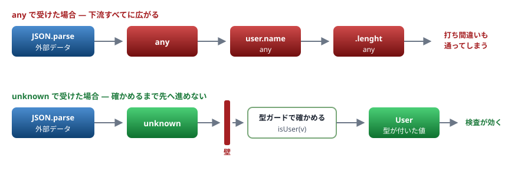
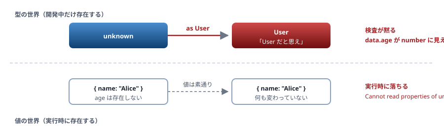

# 06. any・unknown・型アサーション

型検査から降りる3つの方法と、その代償

> 📅 作成: 2026-08-29 / 更新: 2026-08-29

[05. 構造的型付け](05-構造的型付け.md) [07. 関数の型](07-関数の型.md) [資料トップへ戻る](../README.md)

## この章の到達点

- `any` が**伝播する**ことを説明でき、使わずに済ませる方法を持つ
- `unknown` を安全な受け口として使える
- `as` と `!` が**何も検査していない**ことを理解し、使う場所を限定できる

## この章の内容

1. [any — 伝播する](#1-061-any--伝播する)
2. [unknown — 安全な受け口](#2-062-unknown--安全な受け口)
3. [as — 検査を黙らせる](#3-063-as--検査を黙らせる)
4. [! — 非 null アサーション](#4-064---非-null-アサーション)

## 1. 06.1 any — 伝播する

### any は「何でも入る」ではなく「検査しない」

`any` を付けた値には、**どんな操作をしてもエラーになりません。**

```typescript
const x: any = "文字列";

x.toFixed(2);          // エラーにならない（実行時に落ちる）
x.foo.bar.baz;         // エラーにならない（実行時に落ちる）
x();                   // エラーにならない（実行時に落ちる）
```

### 下流に広がる

問題は、**`any` が伝染すること**です。

```typescript
function parse(json: string): any {
	return JSON.parse(json);
}

const user = parse('{"name":"Alice"}');   // user は any
const name = user.name;                   // name も any
const upper = name.toUpperCase();          // upper も any
const len = upper.lenght;                  // 打ち間違いも通る（実行時 undefined）
```

> [!WARNING]
> **1か所の `any` が、その先すべての検査を無効化します。**
> 上の例では `lenght` という打ち間違いが検出されません。**`any` を返す関数を1つ書くと、それを使うコード全体が型のない世界になります。**



図 1 — `any` は下流すべてに広がり、`unknown` は絞り込みを強制する

### 暗黙の any

**strict** 型を書き忘れた引数は、**暗黙に `any`** になります。`strict` が有効ならエラーで教えてくれます。

```typescript
function greet(name) {
	//         ~~~~
	// error TS7006: Parameter 'name' implicitly has an 'any' type.
	//
	// 訳: 引数 'name' は暗黙的に 'any' 型になっています。
	return "Hello, " + name;
}
```

[03. tsconfig](03-tsconfig.md) のとおり、**TypeScript 7 では `strict` が既定で有効**です。5 系から移行すると、このエラーが大量に出ることがあります。

### any が要る場面はほとんどない

| やりたいこと | 使うもの |
|---|---|
| 外部から来た値を受ける | **`unknown`**（06.2） |
| どんな型でも受ける関数を書く | **ジェネリクス**（[09](09-ジェネリクス.md)） |
| オブジェクトなら何でも受ける | `Record<string, unknown>` |
| 型定義のないライブラリを使う | 自分で `.d.ts` を書く（[10](10-モジュールと宣言ファイル.md)） |
| とりあえず動かしたい | `any` でよい。**ただし後で消す前提で、コメントを残す** |

## 2. 06.2 unknown — 安全な受け口

### 「何でも入るが、確かめるまで何もできない」

`unknown` は `any` と同じく<strong>どんな値でも代入できます。</strong>違うのは**使うときに絞り込みを強制される**点です。

```typescript
const x: unknown = "文字列";

x.toUpperCase();
// ~
// error TS18046: 'x' is of type 'unknown'.
//
// 訳: 'x' は 'unknown' 型です。

if (typeof x === "string") {
	x.toUpperCase();      // ここでは string として扱える
}
```

| 項目 | `any` | `unknown` |
|---|---|---|
| どんな値でも代入できる | ✅ **できる** | ✅ **できる** |
| 確かめずに使える | ❌ **使える（危険）** | ✅ **使えない（安全）** |
| 他の型に代入できる | ❌ **できる（危険）** | ✅ **できない** |
| 伝播する | ❌ **する** | ✅ **しない** |

### 外部から来る値は unknown で受ける

`JSON.parse` の戻り値は `any` です。**受け口で `unknown` に変えると、検証を強制できます。**

```typescript
// unknown-parse.ts
function parseJson(text: string): unknown {
	return JSON.parse(text);
}

type User = { name: string; age: number };

function isUser(v: unknown): v is User {
	return (
		typeof v === "object" && v !== null &&
		typeof (v as Record<string, unknown>).name === "string" &&
		typeof (v as Record<string, unknown>).age === "number"
	);
}

const data = parseJson('{"name":"Alice","age":30}');

if (isUser(data)) {
	console.log(`${data.name} は ${data.age} 歳`);
} else {
	console.log("User の形ではありません");
}

console.log(isUser(parseJson('{"name":"Bob"}')));
```

```shell
$ npx tsx unknown-parse.ts
Alice は 30 歳
false
```

`v is User` という書き方は**型ガード関数**です。詳細は [08. 型の絞り込み](08-型の絞り込み.md) で扱います。

> [!TIP]
> **実務ではライブラリを使ってください。**
> 上のような検証を手で書くと、プロパティが増えるたびに書き足すことになります。**zod・valibot のようなスキーマ検証ライブラリ**を使うと、検証と型定義を1か所で書けます。この資料では仕組みを理解するために手書きしています。実務での書き方は [A3. 実務パターン集](A3-実務パターン集.md) に置いています。

## 3. 06.3 as — 検査を黙らせる

### as は変換ではない

`as` は**型アサーション**です。「この値はこの型だと思って扱え」と**コンパイラに指示する**だけで、**値は何も変わりません。**

```typescript
const x: unknown = "文字列";
const n = x as number;        // 通る。何も起きない

console.log(n.toFixed(2));    // 実行時エラー: n.toFixed is not a function
```

> [!NOTE]
> **Java・C# から来た人へ**
> Java の `(Integer) obj` や C# の `(int)obj` は**実行時に検査され、失敗すれば例外**になります。TypeScript の `as` は<strong>実行時に何もしません。</strong>型が消えている以上、検査するものがないためです（[01. 背景](01-背景.md)）。
> C# の `as` 演算子（失敗時に `null`）とも違います。**TypeScript の `as` は、検査を黙らせるだけです。**

### as が嘘をつく瞬間

```typescript
type User = { name: string; age: number };

const data = JSON.parse('{"name":"Alice"}') as User;

console.log(data.age.toFixed(0));
// 型の上では number なので通る
// 実行時: TypeError: Cannot read properties of undefined (reading 'toFixed')
```

<strong>外部から来た値に `as` を使うのが最も危険です。</strong>実際のデータが型と違っていても、誰も教えてくれません。



図 2 — `as` は型の世界だけを書き換える。値は何も変わらない

### as を使ってよい場面

| 判定 | 場面 | 理由 |
|---|---|---|
| ✅ **よい** | 検証を済ませた直後（ブランド型の生成関数など） | 人間が保証した直後で、範囲が狭い |
| ✅ **よい** | `as const` | これは別物。リテラル型として固定する指示（[04](04-型の基本.md)） |
| ⚠️ **条件付き** | DOM の要素取得（`as HTMLInputElement`） | 型定義側が絞れないだけ。実物と一致するか確認する |
| ❌ **避ける** | 外部から来たデータ（JSON・API・環境変数） | **検証していない。`unknown` と型ガードを使う** |
| ❌ **避ける** | エラーを消すため | エラーの原因が残ったままになる |

### 二段階の as は危険信号

```typescript
const s = "文字列";
const n = s as unknown as number;      // 無関係な型にも変換できてしまう
```

`as` は**近い型どうし**でしか使えませんが、`as unknown as` を挟むと<strong>何にでも変換できます。</strong>この書き方が出てきたら、設計を見直す合図です。

### satisfies — 型を確かめるが、型は変えない

`as` の代わりに使える演算子です。<strong>「この型を満たしているか確かめるが、推論された型はそのまま残す」</strong>という意味です。

```typescript
type Config = Record<string, string | number>;

// as だと、推論された具体的な型が失われる
const a = { host: "localhost", port: 3000 } as Config;
// a.port の型は string | number

// satisfies なら、検査もされるし具体的な型も残る
const b = { host: "localhost", port: 3000 } satisfies Config;
// b.port の型は number
```

<strong>設定オブジェクトを書くときは `satisfies` が適しています。</strong>誤った値を検出しつつ、使う側では具体的な型を保てます。

## 4. 06.4 ! — 非 null アサーション

### 「null ではない」と言い切る

```typescript
function find(id: string): User | undefined { /* ... */ }

const user = find("1");
console.log(user.name);
//          ~~~~
// error TS18048: 'user' is possibly 'undefined'.

console.log(user!.name);     // ! を付けると通る（検査されない）
```

`!` は `as` の `null` 版です。<strong>実行時には何も起きません。</strong>間違っていれば `TypeError` になります。

### 使ってよい場面・いけない場面

| 判定 | 例 | 代わりに使うもの |
|---|---|---|
| ❌ **避ける** | 検索結果が見つかる前提のとき | `if (!user) throw new Error(...)` で明示的に落とす |
| ❌ **避ける** | 環境変数（`process.env.PORT!`） | 読み込み時に検証する（[A3](A3-実務パターン集.md)） |
| ⚠️ **条件付き** | 直前に存在を確認済みだが、型が追従しないとき | できれば絞り込みで解決する（[08](08-型の絞り込み.md)） |
| ✅ **よい** | クラスのプロパティ定義（`name!: string`） | 初期化が別の場所で確実に行われる場合のみ |

### ! の代わりに例外を投げる

```typescript
// assert.ts
function findUser(id: string): { name: string } | undefined {
	const db: Record<string, { name: string }> = { "1": { name: "Alice" } };
	return db[id];
}

// ! を使わず、見つからないことを明示的に扱う
function getUserOrThrow(id: string): { name: string } {
	const user = findUser(id);
	if (!user) {
		throw new Error(`ユーザーが見つかりません: ${id}`);
	}
	return user;      // ここでは undefined でないことが型でも分かる
}

console.log(getUserOrThrow("1").name);

try {
	getUserOrThrow("999");
} catch (e) {
	console.log((e as Error).message);
}
```

```shell
$ npx tsx assert.ts
Alice
ユーザーが見つかりません: 999
```

> [!WARNING]
> **どちらも実行時に落ちますが、落ち方が違います。**
> `!` を使うと `TypeError: Cannot read properties of undefined` という**原因の分からないエラー**になります。明示的に投げれば<strong>「何が見つからなかったか」が分かります。</strong>デバッグにかかる時間が変わります。

**まとめ**

| 道具 | 性質 | 使いどころ |
|---|---|---|
| `any` | **検査しない。伝播する** | ほぼ不要。使うなら消す前提でコメントを残す |
| `unknown` | 代入はできるが、使う前に絞り込みが要る | **外部から来る値の受け口** |
| `as` | 検査を黙らせる。**値は変わらない** | 検証済みの直後だけ。外部データには使わない |
| `satisfies` | 検査するが、推論された型は残す | 設定オブジェクトの定義 |
| `!` | `null` 版の `as`。実行時に何もしない | 避ける。明示的に例外を投げるほうが調べやすい |

<strong>次は [07. 関数の型](07-関数の型.md) です。</strong>引数・戻り値・オーバーロード・コールバックの型を扱います。

[05. 構造的型付け](05-構造的型付け.md)

[07. 関数の型](07-関数の型.md)

[資料トップへ戻る](../README.md)
