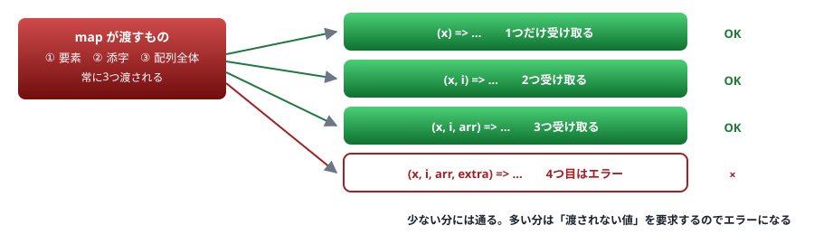

# 07. 関数の型

引数・戻り値・オーバーロード・コールバック

> 📅 作成: 2026-08-29 / 更新: 2026-08-29

[06. any・unknown・型アサーション](06-any-unknown-アサーション.md) [08. 型の絞り込み](08-型の絞り込み.md) [資料トップへ戻る](../README.md)

## この章の到達点

- 戻り値の型を**書くべき場所と省く場所**を判断できる
- コールバックの引数が少なくても通る理由を説明できる
- オーバーロードが Java・C# とは別の仕組みであることを理解する

## この章の内容

1. [引数と戻り値](#1-071-引数と戻り値)
2. [省略可能引数とデフォルト値](#2-072-省略可能引数とデフォルト値)
3. [オーバーロード](#3-073-オーバーロード)
4. [コールバックの型](#4-074-コールバックの型)

## 1. 07.1 引数と戻り値

### 書き方

```typescript
// 関数宣言
function add(a: number, b: number): number {
	return a + b;
}

// アロー関数
const sub = (a: number, b: number): number => a - b;

// 型だけを定義する
type BinaryOp = (a: number, b: number) => number;
const mul: BinaryOp = (a, b) => a * b;      // 引数の型は推論される
```

> [!NOTE]
> **型の位置で使う矢印は `=>`、値としてのアロー関数も `=>` です。**
> 紛らわしいですが、**型の文脈では戻り値の型を書き、値の文脈では処理を書きます。**`type BinaryOp = (a: number, b: number) => number;` の `number` は「戻り値の型」です。

### 戻り値の型は書くべきか

推論に任せられますが、**公開する関数には書くことを勧めます。**

| 判定 | 場面 | 理由 |
|---|---|---|
| ✅ **書く** | 他のファイルから使われる関数 | **実装を変えたとき、変更の影響がその関数の中で止まる** |
| ✅ **書く** | 再帰する関数 | 推論できない場合がある |
| ⬜ **省く** | その場で使う短いコールバック | 書くとかえって読みにくい |
| ⬜ **省く** | 1行で値を返すだけの関数 | 推論で十分 |

```typescript
// 書いておくと、実装ミスがこの関数の中で捕まる
function findName(id: string): string {
	const users: Record<string, string> = { "1": "Alice" };
	return users[id];
	//     ~~~~~~~~~~
	// strict では error TS2322: Type 'string | undefined' is not assignable to type 'string'.
	//
	// 訳: 型 'string | undefined' を型 'string' に割り当てることはできません。
}
```

戻り値の型を書かなければ、この関数の型は `string | undefined` と推論され、<strong>問題は呼び出し側で表面化します。</strong>原因から離れた場所でエラーになります。

### void と undefined

```typescript
function log(msg: string): void {
	console.log(msg);
}
```

| 型 | 意味 |
|---|---|
| `void` | <strong>戻り値を使わない。</strong>何を返してもよいが、呼び出し側は使ってはいけない |
| `undefined` | `undefined` を返す。`return;` または `return undefined;` が必要 |
| `never` | <strong>戻ってこない。</strong>必ず例外を投げるか、無限ループする |

```typescript
function fail(message: string): never {
	throw new Error(message);
}
```

`never` は [08. 型の絞り込み](08-型の絞り込み.md) の網羅性チェックでも使います。

## 2. 07.2 省略可能引数とデフォルト値

### 3つの書き方

```typescript
// ① 省略可能（undefined になりうる）
function greet1(name: string, title?: string) {
	return title ? `${title} ${name}` : name;
}

// ② デフォルト値（省略すると既定値が入る）
function greet2(name: string, title = "様") {
	return `${title} ${name}`;
}

// ③ 可変長引数
function join(sep: string, ...parts: string[]) {
	return parts.join(sep);
}
```

> [!IMPORTANT]
> **省略可能引数は末尾にしか置けません。**
> `function f(a?: string, b: number)` はエラーです。JavaScript の引数は位置で決まるため、**途中を飛ばして渡せない**ためです。引数が増えてきたら**オブジェクトで受け取る**形に変えてください。
> ```typescript
> function createUser(opts: { name: string; age?: number; email?: string }) { /* ... */ }
>
> createUser({ name: "Alice", email: "a@example.com" });   // 順序に縛られない
> ```

### デフォルト値があると型が変わる

```typescript
function f(title = "様") {
	// title の型は string（string | undefined ではない）
	return title.length;
}

f();              // OK
f(undefined);     // OK — undefined を渡すと既定値が使われる
```

### 動かしてみる

```typescript
// args.ts
function greet(name: string, title = "様"): string {
	return `${title} ${name}`;
}

function join(sep: string, ...parts: string[]): string {
	return parts.join(sep);
}

console.log(greet("田中"));
console.log(greet("Alice", "Ms."));
console.log(join(" / ", "a", "b", "c"));
```

```shell
$ npx tsx args.ts
様 田中
Ms. Alice
a / b / c
```

## 3. 07.3 オーバーロード

### 実装は1つだけ

TypeScript のオーバーロードは<strong>「シグネチャを複数書き、実装は1つ」</strong>という形です。

```typescript
// シグネチャ（呼び出し側から見える形）
function parse(input: string): string[];
function parse(input: number): number[];

// 実装（呼び出し側からは見えない）
function parse(input: string | number): string[] | number[] {
	if (typeof input === "string") {
		return input.split(",");
	}
	return [input];
}

const a = parse("x,y");    // string[]
const b = parse(5);        // number[]
```

> [!NOTE]
> **Java・C# から来た人へ**
> Java・C# のオーバーロードは<strong>別々のメソッドが複数存在し、コンパイラが呼び分けます。</strong>TypeScript では**関数は1つだけ**で、型の上で複数の見え方を提供しているにすぎません。
> <strong>実装側で自分で分岐を書く必要があります。</strong>シグネチャと実装が食い違っていても、実装側の型が緩ければエラーになりません。書くときは注意してください。

### 多くの場合は union で足りる

オーバーロードは**引数と戻り値の組み合わせが連動するとき**にだけ必要です。

```typescript
// オーバーロードは不要 — union で書ける
function double(x: number | string): string {
	return typeof x === "number" ? String(x * 2) : x + x;
}
```

| 状況 | 書き方 |
|---|---|
| 戻り値の型が引数によって変わる | **オーバーロード**、またはジェネリクス（[09](09-ジェネリクス.md)） |
| 戻り値の型は同じ | union で受ける |
| 引数の数が違うだけ | 省略可能引数・デフォルト値 |

## 4. 07.4 コールバックの型

### 引数は少なくてよい

[05. 構造的型付け](05-構造的型付け.md)で触れたとおり、**要求より引数が少ない関数は渡せます。**

```typescript
const nums = [1, 2, 3];

nums.map((x) => x * 2);              // OK
nums.map((x, i) => x * i);           // OK — 2つ目も受け取れる
nums.map((x, i, arr) => arr.length); // OK — 3つ目まである
```



図 1 — 引数は少ない分には通る。渡される数より多くは受け取れない

> [!NOTE]
> **これは JavaScript の性質に合わせた仕様です。**
> JavaScript では、渡された引数を無視できます。`map` は常に3つの引数を渡しますが、**受け取る側は必要な数だけ書けばよい**という書き方が普通です。逆に多すぎるとエラーになります（受け取れない値を要求しているため）。

### コールバックの戻り値が void のとき

```typescript
type Handler = (x: number) => void;

const h: Handler = (x) => x * 2;     // OK。数値を返しているが通る
```

`void` は<strong>「戻り値を使わない」</strong>という意味なので、何を返しても構いません。**ただし呼び出し側は戻り値を使えません。**

> [!WARNING]
> **この性質が事故になることがあります。**
> ```typescript
> const ids: string[] = [];
> const users = [{ id: "1" }, { id: "2" }];
>
> // forEach のコールバックは void を返す想定
> users.forEach((u) => ids.push(u.id));   // push は number を返すが、無視される（OK）
> ```
> これは問題ありません。しかし<strong>`async` なコールバックを `forEach` に渡すと、待たれずに進みます。</strong>この扱いは [11. 非同期とエラー処理](11-非同期とエラー処理.md) で扱います。

### 関数を引数に取る関数を書く

```typescript
// callback.ts
type Mapper<T, U> = (item: T, index: number) => U;

function mapAll<T, U>(items: T[], fn: Mapper<T, U>): U[] {
	const out: U[] = [];
	for (let i = 0; i < items.length; i++) {
		out.push(fn(items[i], i));
	}
	return out;
}

console.log(mapAll([1, 2, 3], (n) => n * 10));
console.log(mapAll(["a", "b"], (s, i) => `${i}:${s}`));
```

```shell
$ npx tsx callback.ts
[ 10, 20, 30 ]
[ '0:a', '1:b' ]
```

`<T, U>` の記法は**ジェネリクス**です。[09. ジェネリクス](09-ジェネリクス.md) で扱います。

### this の型

コールバック内の `this` が問題になる場合、**第1引数として `this` の型を宣言できます。**

```typescript
function handler(this: HTMLElement, event: Event) {
	console.log(this.tagName);      // this の型が分かる
}
```

この `this` は<strong>引数ではありません。</strong>型検査のためだけの宣言で、呼び出し側は渡しません。**アロー関数を使えば `this` の問題自体が起きない**ため、必要になる場面は限られます。

**まとめ**

| 項目 | この章の結論 |
|---|---|
| 戻り値の型 | <strong>公開する関数には書く。</strong>実装ミスをその関数の中で止められる |
| 省略可能引数 | 末尾にしか置けない。増えたら**オブジェクトで受け取る** |
| オーバーロード | <strong>実装は1つだけ。</strong>Java・C# とは別の仕組み。多くは union で足りる |
| コールバック | 引数は**少ない分には通る**。`void` は「戻り値を使わない」の意味 |

<strong>次は [08. 型の絞り込み](08-型の絞り込み.md) です。</strong>この資料の**山場のもうひとつ**で、TypeScript を「書ける」から「使える」に変える章です。

[06. any・unknown・型アサーション](06-any-unknown-アサーション.md)

[08. 型の絞り込み](08-型の絞り込み.md)

[資料トップへ戻る](../README.md)
