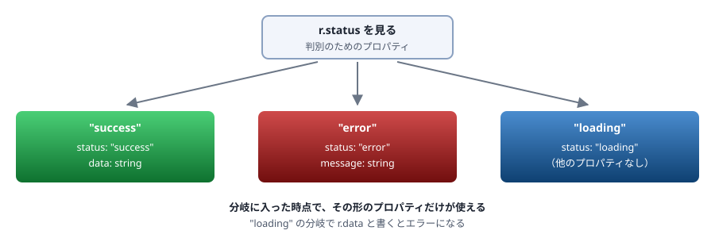
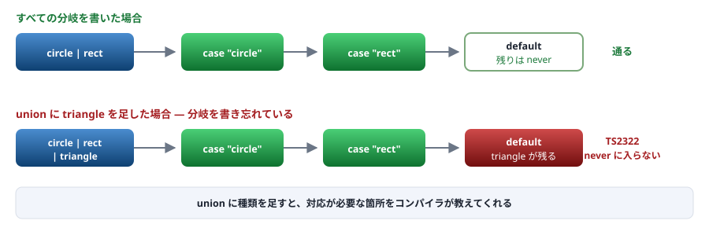

# 08. 型の絞り込み

union を安全に使う ／ この資料の山場②

> 📅 作成: 2026-08-29 / 更新: 2026-08-29

[07. 関数の型](07-関数の型.md) [09. ジェネリクス](09-ジェネリクス.md) [資料トップへ戻る](../README.md)

## この章の到達点

- `if` を書くと**型が変わる**ことを理解し、意図して使える
- **判別可能ユニオン**でデータの形を設計できる
- `never` による**網羅性チェック**で、分岐の漏れをコンパイル時に検出できる

## この章の内容

1. [typeof と instanceof](#1-081-typeof-と-instanceof)
2. [in と真偽値による絞り込み](#2-082-in-と真偽値による絞り込み)
3. [判別可能ユニオン](#3-083-判別可能ユニオン)
4. [型ガード関数](#4-084-型ガード関数)
5. [never による網羅性チェック](#5-085-never-による網羅性チェック)

## 1. 08.1 typeof と instanceof

### if を書くと型が変わる

TypeScript は<strong>条件分岐の中で型を絞り込みます。</strong>これを制御フロー解析と呼びます。

```typescript
function show(id: string | number) {
	// ここでは string | number

	if (typeof id === "string") {
		console.log(id.toUpperCase());    // ここでは string
	} else {
		console.log(id.toFixed(2));       // ここでは number
	}
}
```

> [!NOTE]
> **これは TypeScript 特有の考え方です。**
> Java・C# では、`instanceof` で確認しても**キャストを書かなければ**その型として使えません（Java 16 以降のパターンマッチングを除く）。TypeScript では<strong>確認しただけで型が変わります。</strong>キャストは不要です。

### typeof で判定できるもの

| 式 | 絞り込まれる型 | 注意 |
|---|---|---|
| `typeof x === "string"` | `string` | — |
| `typeof x === "number"` | `number` | `NaN` も number |
| `typeof x === "boolean"` | `boolean` | — |
| `typeof x === "function"` | 関数型 | — |
| `typeof x === "object"` | オブジェクト型 ＋ `null` | <strong>`null` も "object" になる。</strong>別途 `x !== null` が要る |
| `typeof x === "undefined"` | `undefined` | — |

> [!NOTE]
> **`typeof null === "object"` は JavaScript の歴史的な仕様です。**
> オブジェクトかどうかを判定するときは、**必ず `null` のチェックを併記してください。**
> ```typescript
> if (typeof x === "object" && x !== null) { /* ... */ }
> ```

### instanceof — クラスの判定

```typescript
class ApiError extends Error {
	constructor(public status: number, message: string) {
		super(message);
	}
}

function handle(e: unknown) {
	if (e instanceof ApiError) {
		console.log(e.status);       // ApiError として扱える
	} else if (e instanceof Error) {
		console.log(e.message);      // Error として扱える
	}
}
```

> [!IMPORTANT]
> **`instanceof` はクラスにしか使えません。**
> `type` や `interface` は**実行時に存在しない**ため、`x instanceof User` と書くことはできません（[01. 背景](01-背景.md)）。オブジェクトの形を判定したいときは `in` か型ガード関数を使います。

## 2. 08.2 in と真偽値による絞り込み

### in — プロパティの有無で判定する

```typescript
type Dog = { bark: () => void };
type Cat = { meow: () => void };

function speak(animal: Dog | Cat) {
	if ("bark" in animal) {
		animal.bark();      // Dog
	} else {
		animal.meow();      // Cat
	}
}
```

### 真偽値による絞り込み

```typescript
function show(name: string | undefined) {
	if (name) {
		console.log(name.toUpperCase());   // string（undefined が除かれた）
	}
}
```

> [!WARNING]
> **空文字と 0 に注意してください。**
> `if (name)` は `undefined` だけでなく**空文字 `""` も偽**として扱います。数値なら `0` も偽です。**「値が存在するか」を判定したいなら、明示的に書いてください。**
> ```typescript
> if (name !== undefined) { /* "" も通る */ }
> if (name != null)       { /* null と undefined だけを除く */ }
> ```
> `!=` は通常避けますが、`x != null` は<strong>`null` と `undefined` の両方を一度に除く慣用句</strong>として使われます。

### 絞り込みが消える場面

絞り込みは**再代入やコールバックをまたぐと失われます。**

```typescript
function f(v: string | undefined) {
	if (!v) return;
	// ここでは string

	[1, 2].forEach(() => {
		console.log(v.toUpperCase());   // OK（v は const 相当）
	});
}

function g(obj: { v?: string }) {
	if (!obj.v) return;
	// ここでは obj.v は string

	setTimeout(() => {
		console.log(obj.v.toUpperCase());
		//              ~
		// error TS18048: 'obj.v' is possibly 'undefined'.
		// （間に obj.v が変わる可能性があるため）
	});
}
```

<strong>プロパティは変わりうるため、絞り込みが保持されません。</strong>ローカル変数に取り出すと解決します。

```typescript
function g(obj: { v?: string }) {
	const v = obj.v;
	if (!v) return;
	setTimeout(() => console.log(v.toUpperCase()));   // OK
}
```

## 3. 08.3 判別可能ユニオン

### 実務で最もよく使う設計

<strong>共通のプロパティに、それぞれ別のリテラル型を持たせます。</strong>そのプロパティを見れば、どれなのか判定できます。

```typescript
type Result =
	| { status: "success"; data: string }
	| { status: "error"; message: string }
	| { status: "loading" };

function show(r: Result) {
	switch (r.status) {
		case "success":
			console.log(r.data);       // data がある
			break;
		case "error":
			console.log(r.message);    // message がある
			break;
		case "loading":
			console.log("読み込み中");
			break;
	}
}
```



図 1 — 判別用のプロパティを見ることで、残りのプロパティが確定する

### なぜこの形にするか

> [!IMPORTANT]
> **「ありえない組み合わせ」を型で禁止できます。**
> 次のように書くと、**`success` なのに `message` があり `data` がない**という状態を作れてしまいます。
> ```typescript
> // 悪い例 — すべて省略可能にしてしまう
> type Result = {
> 	status: "success" | "error" | "loading";
> 	data?: string;
> 	message?: string;
> };
> ```
> この形だと、使う側は毎回 `data` の存在を確認しなければなりません。**判別可能ユニオンなら、分岐に入った時点で確定します。**

### 動かしてみる

```typescript
// discriminated.ts
type Shape =
	| { kind: "circle"; radius: number }
	| { kind: "rect"; width: number; height: number };

function area(s: Shape): number {
	switch (s.kind) {
		case "circle": return Math.PI * s.radius ** 2;
		case "rect":   return s.width * s.height;
	}
}

console.log(area({ kind: "circle", radius: 2 }).toFixed(2));
console.log(area({ kind: "rect", width: 3, height: 4 }));
```

```shell
$ npx tsx discriminated.ts
12.57
12
```

## 4. 08.4 型ガード関数

### 絞り込みを関数に切り出す

判定を関数にすると、**戻り値の型を `x is T` と書くことで絞り込みを伝えられます。**

```typescript
type User = { name: string; age: number };

function isUser(v: unknown): v is User {
	if (typeof v !== "object" || v === null) return false;
	const o = v as Record<string, unknown>;
	return typeof o.name === "string" && typeof o.age === "number";
}

const data: unknown = JSON.parse('{"name":"Alice","age":30}');

if (isUser(data)) {
	console.log(data.name);      // User として扱える
}
```

> [!WARNING]
> **`v is User` は「そう見なせ」という宣言で、検査されません。**
> 関数の中身が間違っていても、TypeScript は指摘しません。**`return true;` とだけ書いても通ります。**`as` と同じく、<strong>正しさは書き手が保証します。</strong>その代わり、保証する場所が**この関数の中だけ**に閉じ込められます。

### 配列の絞り込み

```typescript
const values: (string | undefined)[] = ["a", undefined, "b"];

// filter だけでは型が変わらない
const a = values.filter((v) => v !== undefined);     // (string | undefined)[]

// 型ガードを書くと変わる
const b = values.filter((v): v is string => v !== undefined);   // string[]
```

### assert 関数

`asserts` を使うと、<strong>「ここを通過したら確定している」</strong>という形も書けます。

```typescript
function assertIsUser(v: unknown): asserts v is User {
	if (!isUser(v)) {
		throw new Error("User の形ではありません");
	}
}

const data: unknown = JSON.parse(text);
assertIsUser(data);
console.log(data.name);      // ここでは User
```

> [!IMPORTANT]
> **`asserts` を使う関数は、明示的な型注釈が要ります。**
> `const f = (v: unknown): asserts v is User => {...}` のようにアロー関数で書くと、**呼び出し側で効きません。**`function` 宣言か、明示的に型を付けた変数として定義してください。

## 5. 08.5 never による網羅性チェック

### 分岐の漏れをコンパイル時に見つける

<strong>`never` は「ありえない型」</strong>です。すべての分岐を書き切れば、最後には `never` だけが残ります。

```typescript
type Shape =
	| { kind: "circle"; radius: number }
	| { kind: "rect"; width: number; height: number };

function area(s: Shape): number {
	switch (s.kind) {
		case "circle": return Math.PI * s.radius ** 2;
		case "rect":   return s.width * s.height;
		default: {
			const _exhaustive: never = s;     // ここに来るはずがない
			throw new Error(`未対応の形状: ${JSON.stringify(_exhaustive)}`);
		}
	}
}
```



図 2 — 分岐を書き切れば残りは `never`。書き忘れると `never` に代入できずエラーになる

### 種類を増やすとエラーになる

```typescript
type Shape =
	| { kind: "circle"; radius: number }
	| { kind: "rect"; width: number; height: number }
	| { kind: "triangle"; base: number; height: number };   // ← 追加した

// area の default 節でエラーになる
//   const _exhaustive: never = s;
//         ~~~~~~~~~~~
// error TS2322: Type '{ kind: "triangle"; base: number; height: number; }'
//               is not assignable to type 'never'.
//
// 訳: 型 '{ kind: "triangle"; ... }' を型 'never' に割り当てることはできません。
```

> [!IMPORTANT]
> **これが TypeScript で最も価値のある機能のひとつです。**
> union に種類を追加したとき、<strong>対応が必要な箇所をコンパイラが列挙してくれます。</strong>実行してみるまで漏れに気づけない、という状況がなくなります。
> <strong>判別可能ユニオンを使うなら、必ず網羅性チェックもセットで書いてください。</strong>この2つは組み合わせて初めて効果があります。

### 動かしてみる

```typescript
// exhaustive.ts
type Event =
	| { type: "click"; x: number; y: number }
	| { type: "key"; code: string }
	| { type: "close" };

function describe(e: Event): string {
	switch (e.type) {
		case "click": return `クリック (${e.x}, ${e.y})`;
		case "key":   return `キー ${e.code}`;
		case "close": return "閉じる";
		default: {
			const _exhaustive: never = e;
			throw new Error(`未対応のイベント: ${JSON.stringify(_exhaustive)}`);
		}
	}
}

console.log(describe({ type: "click", x: 10, y: 20 }));
console.log(describe({ type: "key", code: "Enter" }));
console.log(describe({ type: "close" }));
```

```shell
$ npx tsx exhaustive.ts
クリック (10, 20)
キー Enter
閉じる
```

### if 文でも使える

```typescript
function describe(e: Event): string {
	if (e.type === "click") return `クリック (${e.x}, ${e.y})`;
	if (e.type === "key")   return `キー ${e.code}`;
	if (e.type === "close") return "閉じる";

	const _exhaustive: never = e;
	throw new Error(`未対応: ${JSON.stringify(_exhaustive)}`);
}
```

**まとめ**

| 手段 | 使いどころ | 注意 |
|---|---|---|
| `typeof` | プリミティブの判定 | `typeof null === "object"` |
| `instanceof` | クラスの判定 | `type`・`interface` には使えない |
| `in` | プロパティの有無 | — |
| 真偽値 | 存在の確認 | **`""` と `0` も偽** |
| **判別可能ユニオン** | **実務で最も使う設計** | ありえない組み合わせを型で禁止できる |
| 型ガード関数 | 判定を切り出す | 中身は検査されない。書き手が保証する |
| **`never`** | **網羅性チェック** | 判別可能ユニオンと必ずセットで書く |

<strong>次は [09. ジェネリクス](09-ジェネリクス.md) です。</strong>型を引数として受け取る仕組みを扱います。Java・C# のジェネリクスとの違いにも触れます。

[07. 関数の型](07-関数の型.md)

[09. ジェネリクス](09-ジェネリクス.md)

[資料トップへ戻る](../README.md)
