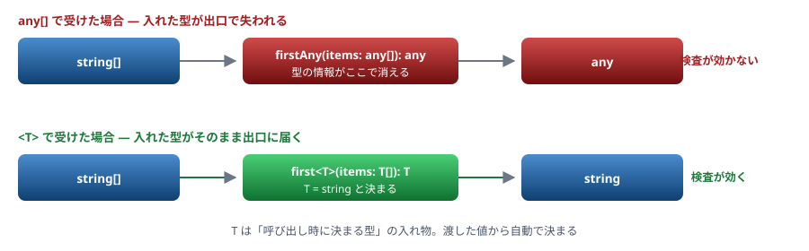
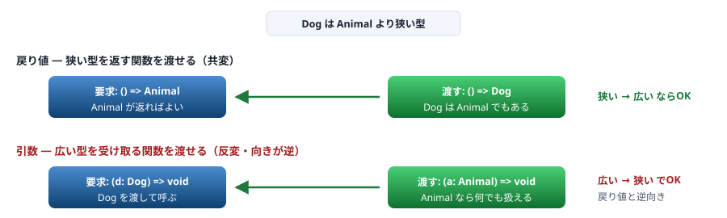

# 09. ジェネリクス

型を引数として受け取る ／ Java・C# との違い

> 📅 作成: 2026-08-29 / 更新: 2026-10-10

[08. 型の絞り込み](08-型の絞り込み.md) [10. モジュールと宣言ファイル](10-モジュールと宣言ファイル.md) [資料トップへ戻る](../README.md)

## この章の到達点

- 型引数を使って、**型を保ったまま**汎用の関数を書ける
- `extends` による制約を書ける
- 実行時に型引数の情報が**残らない**ことを理解し、それを前提に設計できる

## この章の内容

1. [型引数の基本](#1-091-型引数の基本)
2. [extends による制約](#2-092-extends-による制約)
3. [推論が効く場面・効かない場面](#3-093-推論が効く場面効かない場面)
4. [Java・C# のジェネリクスとの違い](#4-094-javac-のジェネリクスとの違い)

## 1. 09.1 型引数の基本

### any との違い

「どんな型でも受け取る関数」を `any` で書くと、**戻り値の型情報も失われます。**

```typescript
// any で書く — 型が消える
function firstAny(items: any[]): any {
	return items[0];
}
const a = firstAny(["x", "y"]);      // a は any（string ではない）

// ジェネリクスで書く — 型が保たれる
function first<T>(items: T[]): T {
	return items[0];
}
const b = first(["x", "y"]);         // b は string
```

> [!NOTE]
> **ジェネリクスは「型の引数」です。**
> `<T>` は「呼び出し時に決まる型」を表す入れ物です。**渡された値から自動で決まる**ため、通常は明示しません。`first<string>(["x"])` と書くこともできますが、推論できるなら不要です。



図 1 — `any` は型を捨てる。ジェネリクスは呼び出しごとに型を運ぶ

### 複数の型引数

```typescript
function pair<A, B>(a: A, b: B): [A, B] {
	return [a, b];
}

const p = pair("x", 1);      // [string, number]
```

### 型にも使える

```typescript
type Box<T> = { value: T };

const b1: Box<string> = { value: "x" };
const b2: Box<number> = { value: 1 };

// 実務でよく使う形
type Result<T, E = Error> =
	| { ok: true; value: T }
	| { ok: false; error: E };
```

`E = Error` は**既定の型引数**です。省略すると `Error` になります。

## 2. 09.2 extends による制約

### 「こういう性質を持つ型だけ」

型引数のままでは、<strong>その値に対して何もできません。</strong>どんな型が来るか分からないためです。

```typescript
function showLength<T>(x: T) {
	console.log(x.length);
	//            ~~~~~~
	// error TS2339: Property 'length' does not exist on type 'T'.
}
```

`extends` で<strong>「少なくともこれを持っている」</strong>と制約します。

```typescript
function showLength<T extends { length: number }>(x: T) {
	console.log(x.length);      // OK
}

showLength("abc");            // OK（string は length を持つ）
showLength([1, 2, 3]);        // OK
showLength(42);               // エラー TS2345
```

### keyof と組み合わせる

オブジェクトのキーを型として扱えます。**実務で最もよく使うジェネリクスの形**です。

```typescript
function getProp<T, K extends keyof T>(obj: T, key: K): T[K] {
	return obj[key];
}

const user = { name: "Alice", age: 30 };

const n = getProp(user, "name");     // string
const a = getProp(user, "age");      // number
const x = getProp(user, "email");
//                      ~~~~~~~
// error TS2345: Argument of type '"email"' is not assignable to
//               parameter of type '"age" | "name"'.
//
// 訳: 型 '"email"' の引数を型 '"age" | "name"' のパラメーターに割り当てることはできません。
```

> [!NOTE]
> **存在しないキーを弾き、キーごとに戻り値の型が変わります。**
> `keyof T` は「`T` のキーの union」（ここでは `"name" | "age"`）、`T[K]` は「`K` というキーの値の型」です。この2つで**キーと値の対応を型として表現できます。**

### 動かしてみる

```typescript
// generics.ts
function getProp<T, K extends keyof T>(obj: T, key: K): T[K] {
	return obj[key];
}

function groupBy<T, K extends string>(items: T[], toKey: (item: T) => K): Record<K, T[]> {
	const out = {} as Record<K, T[]>;
	for (const item of items) {
		const k = toKey(item);
		(out[k] ??= []).push(item);
	}
	return out;
}

const user = { name: "Alice", age: 30 };
console.log(getProp(user, "name"));

const words = ["apple", "avocado", "banana"];
console.log(groupBy(words, (w) => w[0]));
```

```shell
$ npx tsx generics.ts
Alice
{ a: [ 'apple', 'avocado' ], b: [ 'banana' ] }
```

## 3. 09.3 推論が効く場面・効かない場面

### 引数から決まるなら書かなくてよい

```typescript
function first<T>(items: T[]): T { return items[0]; }

first([1, 2, 3]);            // T は number と推論される
first<number>([1, 2, 3]);    // 書いてもよいが冗長
```

### 引数に現れない型引数は推論できない

```typescript
function parse<T>(json: string): T {
	return JSON.parse(json);
}

const user = parse('{"name":"Alice"}');    // T は unknown になる
const u2 = parse<User>('{"name":"Alice"}'); // 明示すれば通る
```

> [!WARNING]
> **この形は避けてください。**
> `parse<User>(...)` は **`as User` と同じで、何も検証していません。**「型引数で指定した型が返ってくる」という保証はどこにもありません。**外部から来る値は `unknown` で受け、型ガードで確かめてください**（[06](06-any-unknown-アサーション.md)・[08](08-型の絞り込み.md)）。

### 推論を助ける書き方

```typescript
// 引数の位置に型引数を出すと推論できる
function fill<T>(length: number, value: T): T[] {
	return Array.from({ length }, () => value);
}

fill(3, "x");        // string[] と推論される
```

### const 型引数

リテラル型として推論させたいときに使います。

```typescript
function toList<const T>(items: readonly T[]): readonly T[] {
	return items;
}

const a = toList(["x", "y"]);        // readonly ("x" | "y")[]
// const 修飾がなければ readonly string[] になる
```

## 4. 09.4 Java・C# のジェネリクスとの違い

### 実行時に型引数は残らない

> [!NOTE]
> **Java・C# から来た人へ**
> C# のジェネリクスは**実行時にも型引数が残ります**（`typeof(T)` が使えます）。Java は型消去のため残りませんが、`Class<T>` を引数で渡す回避策があります。
> <strong>TypeScript では型引数は完全に消えます。</strong>次のようなことはできません。
> ```typescript
> function create<T>(): T {
> 	return new T();      // 書けない。T は実行時に存在しない
> 	//         ~
> 	// error TS2693: 'T' only refers to a type, but is being used as a value here.
> }
> ```
> 型ではなく**コンストラクタそのものを引数で渡します。**
> ```typescript
> function create<T>(ctor: new () => T): T {
> 	return new ctor();
> }
>
> class User { name = ""; }
> const u = create(User);      // User
> ```

### 変性 — 引数の型は逆向きに働く

この節は**読んで意味が分かれば十分**です。自分で書く必要はほとんどありません。

```typescript
type Animal = { name: string };
type Dog = { name: string; bark(): void };

// 戻り値は「狭い型」を返す関数を渡せる（共変）
type GetAnimal = () => Animal;
const g: GetAnimal = (): Dog => ({ name: "ポチ", bark() {} });   // OK

// 引数は「広い型」を受け取る関数を渡せる（反変）
type HandleDog = (d: Dog) => void;
const h: HandleDog = (a: Animal) => console.log(a.name);         // OK
```



図 2 — 戻り値は狭い型を、引数は広い型を渡せる。向きが逆になる

> [!NOTE]
> **直感に反するのは引数のほうです。**
> `Dog` を受け取る関数が要求されている場所に、**`Animal`（より広い型）を受け取る関数**を渡せます。`Animal` を扱える関数なら、`Dog` が来ても困らないためです。逆に「`Dog` しか扱えない関数」は、`Animal` を受け取る場所には渡せません。
> **strict** この検査は `strictFunctionTypes` が有効なときだけ行われます（[03. tsconfig](03-tsconfig.md)）。

### まとめて比較する

| 項目 | Java | C# | TypeScript |
|---|---|---|---|
| 実行時の型情報 | 消える（型消去） | **残る** | 消える |
| `new T()` | 書けない | 書ける（`where T : new()`） | 書けない |
| 制約の書き方 | `<T extends X>` | `where T : X` | `<T extends X>` |
| 制約の対象 | クラス・インターフェース | 同左 | **任意の型**（union やリテラルも可） |
| 変性の指定 | ワイルドカード（`? extends`） | `in` / `out` | **指定しない**（構造から自動で決まる） |

**まとめ**

| 項目 | この章の結論 |
|---|---|
| 目的 | `any` と違い、**型を保ったまま**汎用の関数を書く |
| 制約 | `extends` で「少なくともこれを持つ」を表す。`keyof` との組み合わせが実用的 |
| 推論 | 引数から決まるなら書かない。**引数に現れない型引数は `as` と同じで危険** |
| 実行時 | **型引数は残らない。**`new T()` は書けない。コンストラクタを渡す |

<strong>次は [10. モジュールと宣言ファイル](10-モジュールと宣言ファイル.md) です。</strong>ESM と CJS の相互運用など、**実務で最も事故が多い領域**を扱います。

[08. 型の絞り込み](08-型の絞り込み.md)

[10. モジュールと宣言ファイル](10-モジュールと宣言ファイル.md)

[資料トップへ戻る](../README.md)
