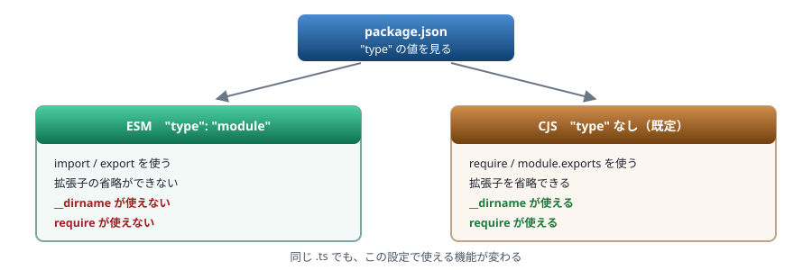
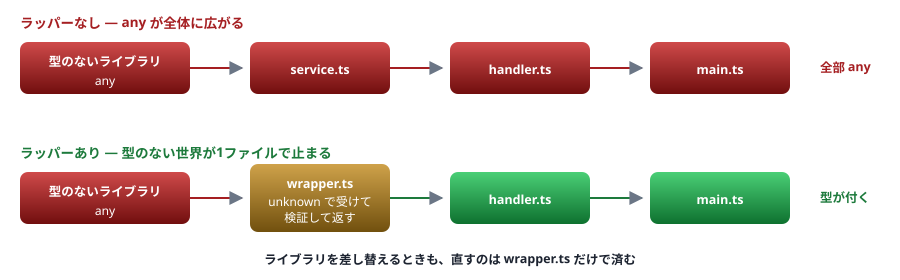

# 10. モジュールと宣言ファイル

ESM と CJS の相互運用 ／ 実務で最も事故が多い領域

> 📅 作成: 2026-08-29 / 更新: 2026-08-29

[09. ジェネリクス](09-ジェネリクス.md) [11. 非同期とエラー処理](11-非同期とエラー処理.md) [資料トップへ戻る](../README.md)

## この章の到達点

- `import type` を使い分けられる
- **ESM と CJS のどちらで動いているか**を判断でき、エラーの原因を切り分けられる
- 型定義がないライブラリに対処できる

## この章の内容

1. [import と export](#1-101-import-と-export)
2. [ESM と CJS](#2-102-esm-と-cjs)
3. [.d.ts と @types](#3-103-dts-と-types)
4. [型定義がないライブラリ](#4-104-型定義がないライブラリ)

## 1. 10.1 import と export

### 基本形

```typescript
// lib.ts
export const greet = (name: string) => `Hello, ${name}`;
export type User = { name: string };

// main.ts
import { greet, type User } from "./lib.ts";
```

### import type — 型だけを取り込む

型は実行時に消えるため、<strong>型だけを import している場合、その行ごと消えます。</strong>明示すると意図が伝わり、消えることも保証されます。

```typescript
import type { User } from "./types.ts";        // 型だけ。実行時には消える
import { greet, type User } from "./lib.ts";   // 値と型を混ぜる書き方
```

> [!NOTE]
> **`import type` を使う理由は、循環参照と副作用の回避です。**
> 型だけが必要なのに通常の `import` を書くと、<strong>そのモジュールが実行時に読み込まれます。</strong>読み込むだけで副作用があるモジュールや、循環参照しているモジュールでは問題になります。**型だけを使うなら `import type` と書いてください。**

### default export は避ける

```typescript
// 名前付き export（推奨）
export const greet = () => {};
import { greet } from "./lib.ts";

// default export
export default function () {}
import whateverName from "./lib.ts";     // 名前を自由に付けられてしまう
```

| 項目 | 名前付き | default |
|---|---|---|
| 名前の統一 | ✅ **強制される** | ❌ **自由に付けられる** |
| リネームの追従 | ✅ **エディタが追える** | ❌ **追えない** |
| CJS との相互運用 | ✅ **問題が少ない** | ❌ **食い違いが起きる** （10.2） |

## 2. 10.2 ESM と CJS

### 2つのモジュール方式がある

| 方式 | 読み込み | 公開 | 由来 |
|---|---|---|---|
| **ESM** | `import` | `export` | JavaScript の標準。現在の主流 |
| **CJS** | `require()` | `module.exports` | Node.js が独自に導入したもの |

### どちらで動くかは package.json が決める

```json
{
	"type": "module"      // ← ESM。省略すると CJS
}
```



図 1 — `package.json` の `"type"` が ESM と CJS を切り替える

#### 実際の違い

```typescript
// main-dirname.ts
console.log(typeof __dirname === "undefined" ? "__dirname は使えない" : "__dirname は使える");
console.log(typeof require === "undefined" ? "require は使えない" : "require は使える");
```

```shell
$ node main-dirname.ts               # package.json に type がない場合
__dirname は使える
require は使える

$ node main-dirname.ts               # "type": "module" の場合
__dirname は使えない
require は使えない
```

> [!NOTE]
> **ESM では `__dirname`・`__filename`・`require` が存在しません。**
> 代わりに `import.meta.dirname`（Node 20.11 以降）を使います。
> ```typescript
> const dir = import.meta.dirname;      // ESM でのファイルの場所
> ```

### よく出るエラーと原因

| エラー | 原因 | 対処 |
|---|---|---|
| `ERR_REQUIRE_ESM` | CJS から ESM を `require` した | 呼ぶ側を ESM にする（`"type": "module"`） |
| `Cannot use import statement outside a module` | CJS のファイルで `import` を書いた | 同上 |
| `ERR_MODULE_NOT_FOUND` | **ESM** **拡張子を省略した** | `"./lib.js"` のように拡張子を書く |
| `__dirname is not defined` | ESM で `__dirname` を使った | `import.meta.dirname` にする |
| `x is not a function`（実行時） | **default export の食い違い** | 下記参照 |

### 拡張子の扱い

**ESM** <strong>ESM では拡張子の省略ができません。</strong>しかも書くのは**出力後の拡張子**です。

```typescript
import { greet } from "./lib";        // ESM では動かない
import { greet } from "./lib.js";     // ← .ts を書いても .js と書く（出力後の名前）
import { greet } from "./lib.ts";     // Node で直接 .ts を実行する場合はこちら
```

> [!WARNING]
> **ここが混乱の元です。**
> `tsc` でコンパイルして実行する場合、`lib.ts` は `lib.js` になります。**`import` のパスは書き換えられない**ため、最初から `.js` と書く必要があります。
> 一方、[Node の型ストリップ](02-実行環境.md)や `tsx` で `.ts` を直接実行する場合は `.ts` と書きます。<strong>どちらの運用にするかを最初に決めてください。</strong>混ぜると必ず事故ります。

### default export の食い違い

```typescript
// CJS のライブラリ
module.exports = function foo() {};

// ESM から使う
import foo from "some-cjs-lib";       // 動く場合と動かない場合がある
import * as foo from "some-cjs-lib";  // foo.default になることがある
```

**ESM** **CJS** `module.exports` と `export default` は**別の仕組み**です。Node とバンドラで解釈が異なることもあります。

```json
{
	"compilerOptions": {
		"esModuleInterop": true        // 相互運用を助ける（既定で有効なことが多い）
	}
}
```

<strong>「型は通るのに実行時に `x is not a function` になる」</strong>ときは、まずこの食い違いを疑ってください。

## 3. 10.3 .d.ts と @types

### .d.ts は型だけを書くファイル

```typescript
// lib.d.ts — 実装はなく、形だけを宣言する
export declare function greet(name: string): string;
export declare const VERSION: string;
```

`tsc` は `.ts` をコンパイルするとき、`declaration: true` を指定すると `.d.ts` も出力します。**ライブラリを配布するときは、`.js` と `.d.ts` をセットで配ります。**

### 型定義がどこから来るか

| 場所 | 確認方法 |
|---|---|
| ライブラリ同梱 | `package.json` の `"types"` または `"typings"` フィールド |
| `@types/*` | `node_modules/@types/` 配下 |
| 自分で書いた | プロジェクト内の `.d.ts` |

### TypeScript 7 では types への明示が必要

**TS7** [02. 実行環境](02-実行環境.md)で触れたとおり、**`@types/*` を入れるだけでは読み込まれません。**

```json
{
	"compilerOptions": {
		"types": ["node"]        // ← 使うものを列挙する
	}
}
```

> [!IMPORTANT]
> **`types` を書くと、書いたものだけが読まれます。**
> `@types/node` と `@types/jest` の両方を使うなら `["node", "jest"]` と書きます。**1つだけ書くと、もう一方が読まれなくなります。**

## 4. 10.4 型定義がないライブラリ

### まず @types を探す

```shell
$ npm i -D @types/ライブラリ名
```

見つからなければ、次の3つから選びます。

### ① 最小限の .d.ts を自分で書く

```typescript
// types/legacy-lib.d.ts
declare module "legacy-lib" {
	export function doSomething(input: string): number;
}
```

```json
{
	"compilerOptions": {
		"typeRoots": ["./node_modules/@types", "./types"]
	},
	"include": ["src/**/*.ts", "types/**/*.d.ts"]
}
```

<strong>使う関数だけ書けば十分です。</strong>全体を網羅する必要はありません。

### ② any として受け入れる（暫定）

```typescript
// types/legacy-lib.d.ts
declare module "legacy-lib";      // すべて any になる
```

> [!WARNING]
> **これは `any` の伝播を招きます。**
> そのライブラリから来る値がすべて `any` になり、**下流の検査が無効化されます**（[06](06-any-unknown-アサーション.md)）。使うなら**受け口で `unknown` に変換**してください。
> ```typescript
> import { doSomething } from "legacy-lib";
>
> // any のまま使わず、受け口で unknown にする
> const result: unknown = doSomething("x");
> if (typeof result === "number") {
> 	console.log(result.toFixed(2));
> }
> ```

### ③ ラッパーを1枚かぶせる

<strong>実務で最も勧められる形です。</strong>型のない世界を1ファイルに閉じ込めます。

```typescript
// src/legacy-wrapper.ts — ここだけが型のない世界に触れる
import * as legacy from "legacy-lib";

export function doSomething(input: string): number {
	const r: unknown = (legacy as { doSomething(s: string): unknown }).doSomething(input);
	if (typeof r !== "number") {
		throw new Error(`legacy-lib が想定外の値を返しました: ${String(r)}`);
	}
	return r;
}
```



図 2 — ラッパーを1枚かぶせると、型のない世界がそこで止まる

他のファイルは `legacy-wrapper.ts` だけを使います。**ライブラリを差し替えるときも、直すのはこのファイルだけです。**

| 手段 | 手間 | 安全性 | 使いどころ |
|---|---|---|---|
| `@types` を入れる | ✅ **小** | ✅ **高** | あるなら必ずこれ |
| 最小の `.d.ts` | ⚠️ **中** | ⚠️ **中** | 使う範囲が狭いとき |
| `declare module` だけ | ✅ **小** | ❌ **低** | 暫定。受け口で `unknown` にする |
| **ラッパー** | ⚠️ **中** | ✅ **高** | **実務で最も勧められる** |

**まとめ**

| 項目 | この章の結論 |
|---|---|
| `import type` | 型だけなら明示する。循環参照と副作用を避けられる |
| ESM / CJS | `package.json` の `"type"` が決める。**ESM では `__dirname`・`require` が使えない** |
| 拡張子 | ESM は省略できない。**`tsc` 経由なら `.js`、直接実行なら `.ts`**。運用を先に決める |
| `@types` | TypeScript 7 では `types` に列挙する。**書いたものだけが読まれる** |
| 型のないライブラリ | <strong>ラッパーを1枚かぶせる。</strong>型のない世界を1ファイルに閉じ込める |

**次は [11. 非同期とエラー処理](11-非同期とエラー処理.md) です。**`Promise` の型と、`catch` が `unknown` である理由を扱います。

[09. ジェネリクス](09-ジェネリクス.md)

[11. 非同期とエラー処理](11-非同期とエラー処理.md)

[資料トップへ戻る](../README.md)
