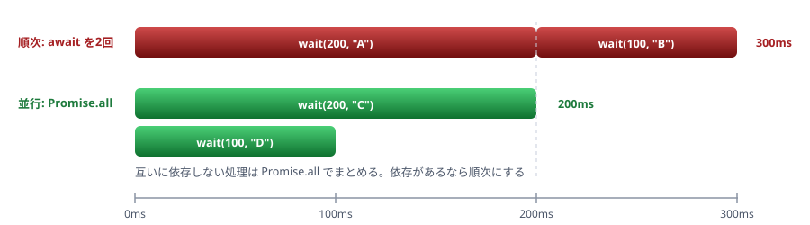
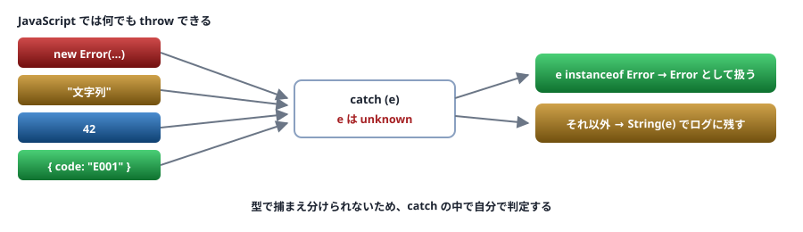

# 11. 非同期とエラー処理

`Promise` の型 ／ `catch` が `unknown` である理由

> 📅 作成: 2026-08-29 / 更新: 2026-08-29

[10. モジュールと宣言ファイル](10-モジュールと宣言ファイル.md) [12. ハンズオン](12-ハンズオン.md) [資料トップへ戻る](../README.md)

## この章の到達点

- `Promise<T>` と `async` 関数の型を読める
- `catch (e)` の `e` を安全に扱える
- 例外で投げるか、戻り値で返すかを**判断基準を持って**選べる

## この章の内容

1. [Promise の型](#1-111-promise-の型)
2. [async と await](#2-112-async-と-await)
3. [catch が unknown である理由](#3-113-catch-が-unknown-である理由)
4. [例外か、戻り値か](#4-114-例外か戻り値か)

## 1. 11.1 Promise の型

### Promise<T> の T は「成功したときの値」

```typescript
const p1: Promise<string> = Promise.resolve("ok");
const p2: Promise<void> = Promise.resolve();

async function load(): Promise<string> {
	return "ok";           // Promise で包まなくてよい
}
```

> [!IMPORTANT]
> **失敗したときの型は指定できません。**
> `Promise<T>` に「エラーの型」を書く場所はありません。**JavaScript では何でも `throw` できる**ためです。この制約が `catch` の扱い（11.3）に効いてきます。
> Java の `throws IOException`、C# のドキュメントコメントに相当するものは**型としては存在しません。**

### async 関数の戻り値は必ず Promise

```typescript
async function f(): string {
	//              ~~~~~~
	// error TS1064: The return type of an async function must be
	//               the global Promise<T> type.
	//
	// 訳: async 関数の戻り値の型は、グローバルな Promise 型である必要があります。
	return "x";
}

async function g(): Promise<string> {    // 正しい
	return "x";
}
```

### 並行実行と型

```typescript
// Promise.all はタプルとして推論される
const [a, b] = await Promise.all([
	Promise.resolve("文字列"),
	Promise.resolve(42),
]);
// a は string、b は number

// allSettled は結果の union を返す
const results = await Promise.allSettled([Promise.resolve(1)]);
for (const r of results) {
	if (r.status === "fulfilled") {
		console.log(r.value);       // 判別可能ユニオン（08）
	} else {
		console.log(r.reason);
	}
}
```

`Promise.allSettled` の戻り値は**判別可能ユニオン**です（[08](08-型の絞り込み.md)）。標準ライブラリでもこの設計が使われています。

## 2. 11.2 async と await

### await し忘れを検出する

```typescript
async function load(): Promise<string> {
	return "data";
}

async function main() {
	const s = load();               // await を忘れた
	console.log(s.toUpperCase());
	//            ~~~~~~~~~~~
	// error TS2339: Property 'toUpperCase' does not exist on type 'Promise<string>'.
}
```

<strong>型があると `await` の忘れが分かります。</strong>JavaScript では `[object Promise]` という文字列が出力されるまで気づけません。

### forEach の中では待たれない

> [!WARNING]
> **これは型では防げない事故です。**
> ```typescript
> const ids = ["1", "2"];
>
> // 待たれない — forEach は Promise を無視する
> ids.forEach(async (id) => {
> 	await save(id);
> });
> console.log("完了");     // save が終わる前に表示される
> ```
> [07. 関数の型](07-関数の型.md)で見たとおり、**`void` を返すコールバックには何を返してもよい**ためエラーになりません。`for...of` か `Promise.all` を使ってください。
> ```typescript
> // 順番に待つ
> for (const id of ids) {
> 	await save(id);
> }
>
> // まとめて待つ
> await Promise.all(ids.map((id) => save(id)));
> ```



図 1 — 順次と並行の所要時間の違い。待ち時間が重なるかどうかで決まる

### 動かしてみる

```typescript
// async-order.ts
function wait(ms: number, label: string): Promise<string> {
	return new Promise((resolve) => setTimeout(() => resolve(label), ms));
}

async function main() {
	// 順番に待つ — 合計 300ms
	const a = await wait(200, "A");
	const b = await wait(100, "B");
	console.log("順次:", a, b);

	// まとめて待つ — 合計 200ms
	const [c, d] = await Promise.all([wait(200, "C"), wait(100, "D")]);
	console.log("並行:", c, d);
}

main();
```

```shell
$ npx tsx async-order.ts
順次: A B
並行: C D
```

## 3. 11.3 catch が unknown である理由

### 何でも throw できる

JavaScript では `Error` 以外も投げられます。

```typescript
throw "文字列";
throw 42;
throw { code: "E001" };
```

そのため、**`catch` で受け取る値の型を `Error` と決めつけられません。**

```typescript
try {
	risky();
} catch (e) {
	// e の型は unknown（strict のとき）
	console.log(e.message);
	//          ~
	// error TS18046: 'e' is of type 'unknown'.
}
```

> [!NOTE]
> **Java・C# から来た人へ**
> Java の `catch (IOException e)`、C# の `catch (IOException e)` のように<strong>型で捕まえ分けることはできません。</strong>TypeScript の `catch` は常に1つで、**中で自分で判定します。**
> **strict** この `unknown` は `useUnknownInCatchVariables`（`strict` に含まれる）の効果です。無効にすると `any` になり、**何でも書けてしまいます**（[03. tsconfig](03-tsconfig.md)）。



図 2 — `throw` できる値に制限がないため、`catch` の変数は `unknown` になる

### 安全に扱う型

```typescript
try {
	risky();
} catch (e) {
	if (e instanceof Error) {
		console.error(e.message, e.stack);
	} else {
		console.error("Error ではない値が投げられました:", String(e));
	}
}
```

### 独自のエラークラス

```typescript
// custom-error.ts
class ApiError extends Error {
	constructor(
		public readonly status: number,
		message: string,
	) {
		super(message);
		this.name = "ApiError";
	}
}

function fetchUser(id: string): string {
	if (id === "") throw new ApiError(400, "id が空です");
	if (id === "999") throw new ApiError(404, "見つかりません");
	return `user-${id}`;
}

for (const id of ["1", "", "999"]) {
	try {
		console.log(fetchUser(id));
	} catch (e) {
		if (e instanceof ApiError) {
			console.log(`[${e.status}] ${e.message}`);
		} else if (e instanceof Error) {
			console.log(`想定外: ${e.message}`);
		} else {
			console.log(`Error ではない値: ${String(e)}`);
		}
	}
}
```

```shell
$ npx tsx custom-error.ts
user-1
[400] id が空です
[404] 見つかりません
```

> [!IMPORTANT]
> **`Error` を継承したら `this.name` を設定してください。**
> 設定しないと、ログに `Error: 見つかりません` と出て<strong>どのエラーか分かりません。</strong>また、`instanceof` はクラスに対してのみ働くので、[構造的型付け](05-構造的型付け.md)とは無関係に**名前で区別されます。**

## 4. 11.4 例外か、戻り値か

### 2つの方針

| 方式 | 書き方 | 長所 | 短所 |
|---|---|---|---|
| 例外 | `throw new Error(...)` | 正常系のコードが読みやすい | <strong>型に現れない。</strong>呼ぶ側が気づけない |
| 戻り値 | `Result<T, E>` を返す | <strong>型に現れる。</strong>処理を強制できる | 毎回分岐が要る |

### Result 型

```typescript
// result.ts
type Result<T, E = Error> =
	| { ok: true; value: T }
	| { ok: false; error: E };

function parsePort(s: string): Result<number> {
	const n = Number(s);
	if (!Number.isInteger(n)) {
		return { ok: false, error: new Error(`整数ではありません: ${s}`) };
	}
	if (n < 1 || n > 65535) {
		return { ok: false, error: new Error(`範囲外です: ${n}`) };
	}
	return { ok: true, value: n };
}

for (const s of ["3000", "abc", "99999"]) {
	const r = parsePort(s);
	if (r.ok) {
		console.log(`OK: ${r.value}`);
	} else {
		console.log(`NG: ${r.error.message}`);
	}
}
```

```shell
$ npx tsx result.ts
OK: 3000
NG: 整数ではありません: abc
NG: 範囲外です: 99999
```

`Result` は**判別可能ユニオン**です（[08](08-型の絞り込み.md)）。`r.ok` を確かめると、`value` と `error` のどちらがあるかが確定します。

### 使い分けの基準

| 状況 | 方式 | 理由 |
|---|---|---|
| 入力の検証（想定内の失敗） | **戻り値** | 失敗が普通に起きる。呼ぶ側に対処を強制したい |
| 設定の不備・プログラムの誤り | **例外** | 回復できない。落として気づかせるべき |
| ライブラリの境界 | **戻り値** | 使う側が例外の存在に気づけない |
| アプリの奥深く | **例外** | すべての層で分岐すると読めなくなる |

> [!IMPORTANT]
> **全体を `Result` にする必要はありません。**
> `Result` は**境界（外部入力・API・ファイル）で使い、内側は例外**という組み合わせが実務的です。すべてを `Result` にすると、分岐が積み重なって読みにくくなります。
> この型は [A2. 型レシピ集](A2-型レシピ集.md) にも収めています。

**まとめ**

| 項目 | この章の結論 |
|---|---|
| `Promise<T>` | `T` は成功時の値。**失敗の型は指定できない** |
| `await` 忘れ | 型で検出できる。ただし `forEach` の中は**型では防げない** |
| `catch (e)` | <strong>`unknown`。</strong>何でも投げられるため。`instanceof Error` で確かめる |
| 独自エラー | `Error` を継承し、**`this.name` を設定する** |
| 例外 / 戻り値 | <strong>境界では `Result`、内側は例外。</strong>全部を `Result` にしない |

<strong>次は [12. ハンズオン](12-ハンズオン.md) です。</strong>ここまでの内容を使い、1本の実用スクリプトを段階的に完成させます。

[10. モジュールと宣言ファイル](10-モジュールと宣言ファイル.md)

[12. ハンズオン](12-ハンズオン.md)

[資料トップへ戻る](../README.md)
