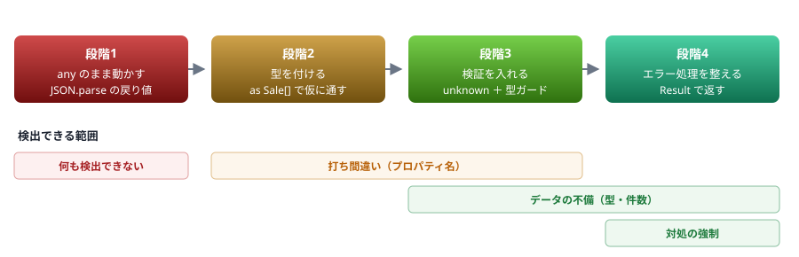

# 12. ハンズオン

JSON を読んで集計する ／ `any` から始めて型を付けていく

> 📅 作成: 2026-08-29 / 更新: 2026-08-29

[11. 非同期とエラー処理](11-非同期とエラー処理.md) [資料トップへ戻る](../README.md)

## この章の到達点

- 既存の JavaScript に**後から型を足す**手順を体験する
- 外部から来るデータを検証してから使う形を、自分で書ける
- ここまでの内容（型・絞り込み・`Result`）を組み合わせられる

## この章の内容

1. [課題と準備](#1-121-課題と準備)
2. [4段階で型を付けていく](#2-122-4段階で型を付けていく)
3. [解答例と詰まりやすい箇所](#3-123-解答例と詰まりやすい箇所)

## 1. 12.1 課題と準備

### 作るもの

売上データの JSON を読み込み、**商品ごとの売上合計を降順で出力する**スクリプトを作ります。

### 準備

```shell
$ mkdir handson && cd handson
$ npm init -y
$ npm i -D typescript tsx @types/node
```

`sales.json` を用意します。

```json
[
	{ "date": "2026-01-15", "product": "ノート", "amount": 1200, "qty": 3 },
	{ "date": "2026-01-16", "product": "ペン", "amount": 300, "qty": 10 },
	{ "date": "2026-02-01", "product": "ノート", "amount": 800, "qty": 2 },
	{ "date": "2026-02-03", "product": "消しゴム", "amount": 150, "qty": 5 },
	{ "date": "2026-02-20", "product": "ペン", "amount": 450, "qty": 15 }
]
```

> [!TIP]
> **手を動かさずに答えだけ見たい場合**
> この課題の解答は `docs/samples/handson/` に置いてあります（`step1.ts` と `step4.ts`、`sales.json`）。[02. 実行環境](02-実行環境.md)で触れたとおり、`npm i` のあと `npx tsx step4.ts` で動きます。
> <strong>ただし、まず自分で書いてみてください。</strong>この章の目的は完成品を読むことではなく、**`any` を潰していく過程を体験すること**です。

### 目指す出力

```shell
$ npx tsx step4.ts
ノート: 2000 円
ペン: 750 円
消しゴム: 150 円
```

> [!IMPORTANT]
> **いきなり完成形を書こうとしないでください。**
> 実務で TypeScript を導入する場面は、**既存の JavaScript に型を足す**形が大半です。この課題も同じ順序で進めます。**まず動かし、次に型を付け、最後に検証とエラー処理を足します。**

## 2. 12.2 4段階で型を付けていく



図 1 — 段階が進むほど、検出できる問題の範囲が広がる

### 段階1 — まず動かす

型を気にせず、JavaScript を書く要領で動かします。

```typescript
// step1.ts
import { readFileSync } from "node:fs";

const text = readFileSync("sales.json", "utf8");
const sales = JSON.parse(text);

const totals: any = {};
for (const s of sales) {
	totals[s.product] = (totals[s.product] ?? 0) + s.amount;
}

console.log(totals);
```

```shell
$ npx tsx step1.ts
{ 'ノート': 2000, 'ペン': 750, '消しゴム': 150 }
```

> [!WARNING]
> **動きますが、検査は何も働いていません。**
> `JSON.parse` の戻り値は `any` なので、`s.product` も `s.amount` も `any` です（[06](06-any-unknown-アサーション.md)）。**`s.prodcut` と打ち間違えても、実行するまで気づけません。**

#### やってみること

- `s.product` を `s.prodcut` に変えて実行し、**エラーにならないこと**を確かめる
- `npx tsc --noEmit step1.ts` を実行し、**それでも通ること**を確かめる

### 段階2 — 型を付ける

データの形を `type` で書き、集計結果を `Map` に変えます。

```typescript
// step2.ts
import { readFileSync } from "node:fs";

type Sale = { date: string; product: string; amount: number; qty: number };

const text = readFileSync("sales.json", "utf8");
const sales = JSON.parse(text) as Sale[];      // ← まだ嘘をついている

function sumByProduct(sales: Sale[]): Map<string, number> {
	const out = new Map<string, number>();
	for (const s of sales) {
		out.set(s.product, (out.get(s.product) ?? 0) + s.amount);
	}
	return out;
}

for (const [product, total] of sumByProduct(sales)) {
	console.log(`${product}: ${total} 円`);
}
```

> [!WARNING]
> **打ち間違いは検出できるようになりましたが、`as Sale[]` が残っています。**
> [06](06-any-unknown-アサーション.md) で見たとおり、<strong>`as` は何も検証していません。</strong>JSON の中身が違っていても通ってしまいます。段階3で外します。

#### やってみること

- `sales.json` の `amount` を `"1200"`（文字列）に書き換えて実行する
- 型エラーは出ず、**集計結果がおかしくなる**ことを確かめる

### 段階3 — 検証を入れる

`as` をやめ、`unknown` で受けて**型ガードで確かめます**（[08](08-型の絞り込み.md)）。

```typescript
// step3.ts（抜粋）
function isSale(v: unknown): v is Sale {
	if (typeof v !== "object" || v === null) return false;
	const o = v as Record<string, unknown>;
	return (
		typeof o.date === "string" &&
		typeof o.product === "string" &&
		typeof o.amount === "number" &&
		typeof o.qty === "number"
	);
}

const parsed: unknown = JSON.parse(text);

if (!Array.isArray(parsed)) {
	throw new Error("配列ではありません");
}

const sales: Sale[] = [];
for (let i = 0; i < parsed.length; i++) {
	const row: unknown = parsed[i];
	if (!isSale(row)) {
		throw new Error(`${i} 件目の形式が不正です`);
	}
	sales.push(row);
}
```

#### やってみること

- 再び `amount` を文字列に変えて実行し、**件数付きのエラーで止まること**を確かめる

### 段階4 — エラー処理を整える

例外を投げる代わりに `Result` を返し、**呼ぶ側に対処を強制します**（[11](11-非同期とエラー処理.md)）。

| 段階 | 状態 | 検出できるもの |
|---|---|---|
| 1 | `any` のまま | ❌ **何も検出できない** |
| 2 | 型を付けたが `as` で嘘 | ⚠️ **打ち間違いだけ** |
| 3 | 検証を入れた | ✅ **データの不備も検出** |
| 4 | `Result` で返す | ✅ **呼ぶ側に対処を強制** |

## 3. 12.3 解答例と詰まりやすい箇所

### 解答例（段階4）

```typescript
// step4.ts
import { readFileSync } from "node:fs";

type Sale = { date: string; product: string; amount: number; qty: number };

type Result<T, E = Error> =
	| { ok: true; value: T }
	| { ok: false; error: E };

function isSale(v: unknown): v is Sale {
	if (typeof v !== "object" || v === null) return false;
	const o = v as Record<string, unknown>;
	return (
		typeof o.date === "string" &&
		typeof o.product === "string" &&
		typeof o.amount === "number" &&
		typeof o.qty === "number"
	);
}

function loadSales(path: string): Result<Sale[]> {
	let text: string;
	try {
		text = readFileSync(path, "utf8");
	} catch {
		return { ok: false, error: new Error(`ファイルを読めません: ${path}`) };
	}

	let parsed: unknown;
	try {
		parsed = JSON.parse(text);
	} catch {
		return { ok: false, error: new Error(`JSON として読めません: ${path}`) };
	}

	if (!Array.isArray(parsed)) {
		return { ok: false, error: new Error("配列ではありません") };
	}

	const sales: Sale[] = [];
	for (let i = 0; i < parsed.length; i++) {
		const row: unknown = parsed[i];
		if (!isSale(row)) {
			return { ok: false, error: new Error(`${i} 件目の形式が不正です`) };
		}
		sales.push(row);
	}
	return { ok: true, value: sales };
}

function sumByProduct(sales: Sale[]): Map<string, number> {
	const out = new Map<string, number>();
	for (const s of sales) {
		out.set(s.product, (out.get(s.product) ?? 0) + s.amount);
	}
	return out;
}

const r = loadSales("sales.json");
if (!r.ok) {
	console.error(`エラー: ${r.error.message}`);
	process.exit(1);
}

for (const [product, total] of [...sumByProduct(r.value)].sort((a, b) => b[1] - a[1])) {
	console.log(`${product}: ${total} 円`);
}

const missing = loadSales("nothing.json");
console.log(missing.ok ? "読めた" : `想定どおり失敗: ${missing.error.message}`);
```

```shell
$ npx tsx step4.ts
ノート: 2000 円
ペン: 750 円
消しゴム: 150 円
想定どおり失敗: ファイルを読めません: nothing.json
```

配列でない JSON を渡すと、次のように止まります。

```shell
$ npx tsx step4.ts          # sales.json が { "not": "an array" } の場合
エラー: 配列ではありません
```

### 詰まりやすい箇所

| 症状 | 原因 | 対処 |
|---|---|---|
| `TS2591: Cannot find name 'node:fs'` | **TS7** `types` の指定漏れ | `tsconfig.json` に `"types": ["node"]`（[02](02-実行環境.md)） |
| `parsed[i]` が `any` になる | `Array.isArray` の後は `any[]` になる | `const row: unknown = parsed[i];` と明示する |
| `out.get(...)` が `undefined` かもしれない | **strict** `Map.get` は `T \| undefined` を返す | `?? 0` で既定値を与える（[04](04-型の基本.md)） |
| `process.exit` の後もエラーになる | 型の上では処理が続く扱い | `process.exit` は `never` を返すので通常は不要。出なければ `return` を足す |
| ソートの結果が変わらない | `Map` を直接 `sort` できない | `[...map]` で配列にしてから `sort` する |

### 発展課題

- **月別に集計する** — `date` の先頭7文字（`"2026-01"`）でまとめる
- **単価を出す** — `amount / qty`。`qty` が 0 のときの扱いを決める
- **検証を厳しくする** — `date` が `YYYY-MM-DD` の形式か、`amount` が 0 以上かを確かめる
- **ブランド型を使う** — 検証済みの日付を `ISODate` 型にする（[05](05-構造的型付け.md)）
- **スキーマ検証ライブラリに置き換える** — `isSale` を zod などで書き直し、**手書きとの差**を比べる

> [!NOTE]
> **ここまでで本編は終わりです。**
> 実務で必要になったときは、付録から引いてください。<strong>エラーの意味が分からないときは [A1. 逆引き](A1-逆引き.md)、書きたい型が決まっているときは [A2. 型レシピ集](A2-型レシピ集.md)、処理ごとまとめて欲しいときは [A3. 実務パターン集](A3-実務パターン集.md)</strong>です。

**まとめ**

| 段階 | やったこと | 使った知識 |
|---|---|---|
| 1 | まず動かす | `any` の危険性（[06](06-any-unknown-アサーション.md)） |
| 2 | 型を付ける | オブジェクト型（[04](04-型の基本.md)）、`as` の限界（[06](06-any-unknown-アサーション.md)） |
| 3 | 検証を入れる | `unknown` と型ガード（[08](08-型の絞り込み.md)） |
| 4 | エラー処理を整える | 判別可能ユニオンと `Result`（[11](11-非同期とエラー処理.md)） |

<strong>付録は必要になったときに引いてください。</strong>順番に読む必要はありません。

[11. 非同期とエラー処理](11-非同期とエラー処理.md)

[資料トップへ戻る](../README.md)
