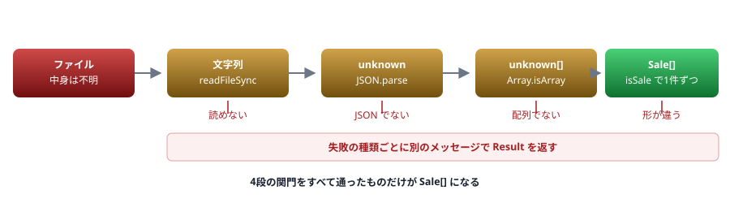

# A3. 実務パターン集

そのまま貼って使えるコードのまとまり

> 📅 作成: 2026-08-29 / 更新: 2026-08-29

[資料トップへ戻る](../README.md)

## この付録の使い方

- <strong>「こういう*処理*を書きたい」</strong>から引きます
- 型の断片だけが欲しいときは [A2. 型レシピ集](A2-型レシピ集.md) を見てください
- すべて **Node で実際に動かしたコード**です

## パターン一覧

1. [JSON を読んで検証する](#1-a31-json-を読んで検証する)
2. [環境変数を型付きで読む](#2-a32-環境変数を型付きで読む)
3. [API クライアント](#3-a33-api-クライアント)
4. [CLI 引数を解析する](#4-a34-cli-引数を解析する)
5. [ファイル操作とエラー処理](#5-a35-ファイル操作とエラー処理)

## 1. A3.1 JSON を読んで検証する

<strong>外部から来るデータは、型を書いただけでは守られません。</strong>受け口で検証します。

```typescript
// load-json.ts
import { readFileSync } from "node:fs";

type Result<T, E = Error> = { ok: true; value: T } | { ok: false; error: E };

type Sale = { date: string; product: string; amount: number };

function isSale(v: unknown): v is Sale {
	if (typeof v !== "object" || v === null) return false;
	const o = v as Record<string, unknown>;
	return (
		typeof o.date === "string" &&
		typeof o.product === "string" &&
		typeof o.amount === "number"
	);
}

export function loadSales(path: string): Result<Sale[]> {
	let text: string;
	try {
		text = readFileSync(path, "utf8");
	} catch {
		return { ok: false, error: new Error(`ファイルを読めません: ${path}`) };
	}

	let parsed: unknown;
	try {
		parsed = JSON.parse(text);
	} catch {
		return { ok: false, error: new Error(`JSON として読めません: ${path}`) };
	}

	if (!Array.isArray(parsed)) {
		return { ok: false, error: new Error("配列ではありません") };
	}

	const rows: Sale[] = [];
	for (let i = 0; i < parsed.length; i++) {
		const row: unknown = parsed[i];
		if (!isSale(row)) {
			return { ok: false, error: new Error(`${i} 件目の形式が不正です`) };
		}
		rows.push(row);
	}
	return { ok: true, value: rows };
}
```



図 1 — 外部データが型の付いた値になるまでの4段階。各段で失敗の種類が違う

> [!NOTE]
> **ポイント3つ**
> - `JSON.parse` の戻り値を **`unknown` で受ける**（`any` のまま使わない）
> - `readFileSync` と `JSON.parse` を**別々に `try` で囲む**（原因を区別するため）
> - 不正な行は**何件目か**を返す（デバッグにかかる時間が変わる）

### スキーマ検証ライブラリを使う場合

プロパティが増えると手書きは維持できません。**実務では zod などを使います。**

```typescript
import { z } from "zod";

const SaleSchema = z.object({
	date: z.string(),
	product: z.string(),
	amount: z.number(),
});

type Sale = z.infer<typeof SaleSchema>;      // 型はスキーマから生成される

const result = SaleSchema.array().safeParse(JSON.parse(text));
if (!result.success) {
	console.error(result.error.issues);
}
```

<strong>型定義と検証を1か所で書けます。</strong>手書きの型ガードと違い、**型と検証がずれません。**

## 2. A3.2 環境変数を型付きで読む

`process.env.X` の型は `string | undefined` です。**起動時にまとめて検証**し、以降は型の付いた値だけを使います。

```typescript
// env.ts
function required(name: string): string {
	const v = process.env[name];
	if (v === undefined || v === "") {
		throw new Error(`環境変数 ${name} が設定されていません`);
	}
	return v;
}

function optional(name: string, fallback: string): string {
	const v = process.env[name];
	return v === undefined || v === "" ? fallback : v;
}

function asPort(name: string, fallback: number): number {
	const v = process.env[name];
	if (v === undefined || v === "") return fallback;
	const n = Number(v);
	if (!Number.isInteger(n) || n < 1 || n > 65535) {
		throw new Error(`環境変数 ${name} がポート番号として不正です: ${v}`);
	}
	return n;
}

export const ENV = {
	nodeEnv: optional("NODE_ENV", "development"),
	port: asPort("PORT", 3000),
	// databaseUrl: required("DATABASE_URL"),
} as const;
```

> [!WARNING]
> **アプリの奥で `process.env` を直接読まないでください。**
> 読む場所が散らばると、<strong>どの環境変数が必要なのか分からなくなります。</strong>この `env.ts` を1か所に置き、**起動時に落とす**ようにすると、設定漏れが実行直後に分かります。
> `process.env.PORT!` のように `!` で黙らせるのは**最悪の対処**です（[06.4](06-any-unknown-アサーション.md)）。未設定なら `undefined` のまま先に進み、原因の分からないエラーになります。

## 3. A3.3 API クライアント

`fetch` の戻り値も検証が要ります。**`response.json()` は `any` を返します。**

```typescript
// api.ts
type Result<T, E = Error> = { ok: true; value: T } | { ok: false; error: E };

type ApiError =
	| { kind: "network"; cause: unknown }
	| { kind: "status"; status: number }
	| { kind: "shape"; detail: string };

export async function getJson<T>(
	url: string,
	isValid: (v: unknown) => v is T,
): Promise<Result<T, ApiError>> {
	let res: Response;
	try {
		res = await fetch(url);
	} catch (cause) {
		return { ok: false, error: { kind: "network", cause } };
	}

	if (!res.ok) {
		return { ok: false, error: { kind: "status", status: res.status } };
	}

	const body: unknown = await res.json();
	if (!isValid(body)) {
		return { ok: false, error: { kind: "shape", detail: "想定した形ではありません" } };
	}
	return { ok: true, value: body };
}
```

#### 使う側

```typescript
type User = { id: string; name: string };

function isUser(v: unknown): v is User {
	if (typeof v !== "object" || v === null) return false;
	const o = v as Record<string, unknown>;
	return typeof o.id === "string" && typeof o.name === "string";
}

const r = await getJson("https://example.com/api/user/1", isUser);
if (r.ok) {
	console.log(r.value.name);
} else {
	switch (r.error.kind) {
		case "network": console.error("通信に失敗しました"); break;
		case "status":  console.error(`HTTP ${r.error.status}`); break;
		case "shape":   console.error(r.error.detail); break;
	}
}
```

> [!WARNING]
> **型引数 `<T>` だけを渡す設計にしないでください。**
> ```typescript
> // 危険 — 検証していないのに型が付く
> const user = await getJson<User>(url);
> ```
> これは `as User` と同じです（[09.3](09-ジェネリクス.md)）。**検証関数を引数で受け取る**形にすると、型と検証がセットになります。

#### タイムアウトを付ける

```typescript
const controller = new AbortController();
const timer = setTimeout(() => controller.abort(), 5000);
try {
	const res = await fetch(url, { signal: controller.signal });
	// ...
} finally {
	clearTimeout(timer);
}
```

## 4. A3.4 CLI 引数を解析する

Node には `parseArgs` が標準で入っています。**ライブラリを足す必要はありません。**

```typescript
// cli.ts
import { parseArgs } from "node:util";

const { values, positionals } = parseArgs({
	options: {
		input:   { type: "string",  short: "i" },
		verbose: { type: "boolean", short: "v", default: false },
		count:   { type: "string",  default: "1" },
	},
	allowPositionals: true,
});

// values.input は string | undefined
if (values.input === undefined) {
	console.error("使い方: cli.ts --input <ファイル> [--verbose] [--count N]");
	process.exit(1);
}

const count = Number(values.count);
if (!Number.isInteger(count) || count < 1) {
	console.error(`--count は 1 以上の整数で指定してください: ${values.count}`);
	process.exit(1);
}

console.log({ input: values.input, verbose: values.verbose, count, positionals });
```

```shell
$ npx tsx cli.ts --input data.json -v --count 3 extra
{ input: 'data.json', verbose: true, count: 3, positionals: [ 'extra' ] }
```

> [!IMPORTANT]
> **`parseArgs` は数値型を扱えません。**
> `type` に指定できるのは `"string"` と `"boolean"` だけです。<strong>数値は文字列で受けて、自分で変換・検証します。</strong>ここで検証しておくと、以降のコードは数値として扱えます。

## 5. A3.5 ファイル操作とエラー処理

#### 存在確認は「読んでみる」

```typescript
import { readFile } from "node:fs/promises";

// 悪い例 — 確認と読み込みの間に状態が変わりうる
// if (existsSync(path)) { const text = await readFile(path, "utf8"); }

// よい例 — 読んでみて失敗を扱う
async function readTextOrNull(path: string): Promise<string | null> {
	try {
		return await readFile(path, "utf8");
	} catch (e) {
		if (isNotFound(e)) return null;
		throw e;                      // それ以外は握りつぶさない
	}
}

function isNotFound(e: unknown): boolean {
	return typeof e === "object" && e !== null &&
		(e as { code?: unknown }).code === "ENOENT";
}
```

> [!IMPORTANT]
> **Node のエラーは `code` プロパティを持ちます。**
> `Error` の型定義には `code` がないため、<strong>そのままでは読めません。</strong>上のように型ガードを書くか、`NodeJS.ErrnoException` を使います。**「エラーの種類で分岐する」ときは `code` を見ます**（メッセージ文字列で判定しない）。

#### よく使う code

| code | 意味 |
|---|---|
| `ENOENT` | ファイル・ディレクトリが存在しない |
| `EACCES` | 権限がない |
| `EISDIR` | ディレクトリをファイルとして開こうとした |
| `EEXIST` | すでに存在する |

#### 書き込みは一時ファイル経由

```typescript
import { writeFile, rename } from "node:fs/promises";

// 書き込み中に落ちても、元のファイルが壊れない
async function writeAtomic(path: string, text: string): Promise<void> {
	const tmp = `${path}.tmp`;
	await writeFile(tmp, text, "utf8");
	await rename(tmp, path);
}
```

#### エラーの原因を保つ

```typescript
try {
	await readFile(path, "utf8");
} catch (e) {
	// cause を渡すと、元のエラーが失われない
	throw new Error(`設定ファイルを読めません: ${path}`, { cause: e });
}
```

> [!WARNING]
> **`{ cause: e }` は必ず付けてください。**
> 付けないと**元のエラーの情報（`code`・スタックトレース）が失われます。**「設定ファイルを読めません」とだけ言われても、権限の問題なのか存在しないのか分かりません。

#### まとめ

| 場面 | やること |
|---|---|
| 外部データを受け取る | `unknown` で受けて**検証してから**使う |
| 環境変数 | **起動時に1か所で検証**し、以降は型付きの値を使う |
| API 呼び出し | 検証関数を引数で渡す。**型引数だけの指定は `as` と同じ** |
| CLI 引数 | `node:util` の `parseArgs`。**数値は自分で変換・検証** |
| ファイル操作 | 存在確認より**読んでみて失敗を扱う**。`code` で分岐し、`cause` を残す |

[資料トップへ戻る](../README.md)
