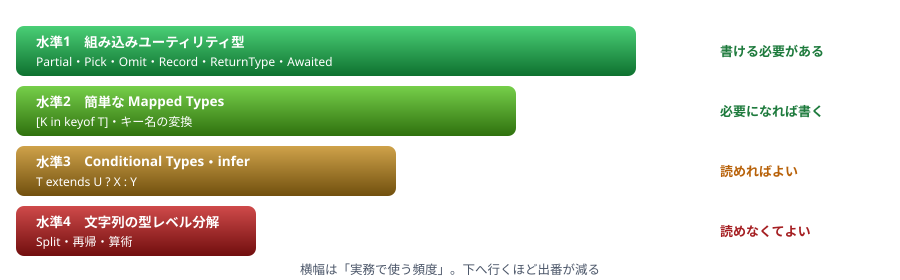

# A4. 型レベルプログラミング

ライブラリの型定義を読むための道具立て

> 📅 作成: 2026-08-29 / 更新: 2026-08-29

[資料トップへ戻る](../README.md)

## この付録の位置づけ

- <strong>目標は「読めること」です。</strong>自分で書けるようになる必要はありません
- ライブラリの型定義やエディタの表示に出てくる記法を、**意味が分かる**状態にします
- 実務で自分から書くのは、A4.1 のユーティリティ型と、A4.2 の簡単な Mapped Types までで足ります

## この付録の内容

1. [組み込みユーティリティ型](#1-a41-組み込みユーティリティ型)
2. [Mapped Types — キーを回す](#2-a42-mapped-types--キーを回す)
3. [Conditional Types と infer](#3-a43-conditional-types-と-infer)
4. [テンプレートリテラル型](#4-a44-テンプレートリテラル型)

## 1. A4.1 組み込みユーティリティ型

**まずこれだけ覚えれば実務の大半は足ります。**

| 型 | 意味 | 例 |
|---|---|---|
| `Partial<T>` | すべてのプロパティを省略可能にする | 更新用の型 |
| `Required<T>` | すべてを必須にする | 既定値で埋めた後の型 |
| `Readonly<T>` | すべてを読み取り専用にする（**1段階だけ**） | 設定オブジェクト |
| `Pick<T, K>` | 指定したキーだけ取り出す | `Pick<User, "id" \| "name">` |
| `Omit<T, K>` | 指定したキーを除く | `Omit<User, "password">` |
| `Record<K, V>` | キーと値の型を指定した辞書 | `Record<string, number>` |
| `ReturnType<F>` | 関数の戻り値の型 | `ReturnType<typeof f>` |
| `Parameters<F>` | 関数の引数の型（タプル） | `Parameters<typeof f>[0]` |
| `Awaited<T>` | `Promise` を剥がした型 | `Awaited<ReturnType<typeof load>>` |
| `NonNullable<T>` | `null`・`undefined` を除く | `NonNullable<string \\| null>` |
| `Exclude<T, U>` | union から取り除く | `Exclude<Status, "closed">` |
| `Extract<T, U>` | union から取り出す | `Extract<Shape, { kind: "circle" }>` |

#### 組み合わせて使う

```typescript
type User = { id: string; name: string; password: string; age?: number };

// 外部に返す形（password を除く）
type PublicUser = Omit<User, "password">;

// 更新用（id 以外を省略可能に）
type UserPatch = Partial<Omit<User, "id">>;

// 関数の戻り値から型を取る
async function loadUser(): Promise<PublicUser> { /* ... */ }
type Loaded = Awaited<ReturnType<typeof loadUser>>;     // PublicUser
```

> [!IMPORTANT]
> **`Readonly<T>` は1段階しか効きません。**
> ```typescript
> type Config = Readonly<{ db: { host: string } }>;
> const c: Config = { db: { host: "localhost" } };
>
> c.db = { host: "x" };      // エラー（1段階目は守られる）
> c.db.host = "x";           // 通ってしまう（2段階目は守られない）
> ```
> 入れ子まで守るには `DeepReadonly` を自分で書きます（[A2.5](A2-型レシピ集.md)）。

## 2. A4.2 Mapped Types — キーを回す

### 基本の形

```typescript
type MyReadonly<T> = {
	readonly [K in keyof T]: T[K];
};
```

<strong>`[K in keyof T]` は「`T` のキーをすべて回す」</strong>という意味です。`for...of` の型版だと考えてください。

| 記法 | 意味 |
|---|---|
| `[K in keyof T]` | `T` のキーを回す。`K` が各キーの名前 |
| `T[K]` | キー `K` の値の型 |
| `readonly` / `?` | 付けると全キーに適用される |
| `-readonly` / `-?` | **外す**（`Required<T>` の実装がこれ） |
| `as` | キー名を変換する |

#### 標準のユーティリティ型はこれで書かれている

```typescript
type Partial<T>  = { [K in keyof T]?: T[K] };
type Required<T> = { [K in keyof T]-?: T[K] };      // ? を外す
type Readonly<T> = { readonly [K in keyof T]: T[K] };
type Pick<T, K extends keyof T> = { [P in K]: T[P] };
type Record<K extends keyof any, V> = { [P in K]: V };
```

#### キー名を変換する

```typescript
type Getters<T> = {
	[K in keyof T as `get${Capitalize<string & K>}`]: () => T[K];
};

type User = { name: string; age: number };
type UserGetters = Getters<User>;
// { getName: () => string; getAge: () => number }
```

#### 値の型でキーを絞る

```typescript
// 関数のプロパティだけを抜き出す
type FunctionKeys<T> = {
	[K in keyof T]: T[K] extends (...args: never[]) => unknown ? K : never;
}[keyof T];

type Api = { load(): void; name: string; save(): void };
type Methods = FunctionKeys<Api>;      // "load" | "save"
```

> [!TIP]
> **`{ ... }[keyof T]` という形を覚えてください。**
> 「各キーに対して型を作り、最後に全部を union にする」という意味です。`never` は union の中で**消える**ため、条件に合わないキーが除かれます。**この形はライブラリの型定義で頻出します。**

## 3. A4.3 Conditional Types と infer

### 型の if 文

```typescript
type IsString<T> = T extends string ? "はい" : "いいえ";

type A = IsString<"abc">;      // "はい"
type B = IsString<123>;        // "いいえ"
```

`T extends U ? X : Y` は<strong>「`T` が `U` に代入できるなら `X`、できなければ `Y`」</strong>です。

### union は分配される

```typescript
type ToArray<T> = T extends unknown ? T[] : never;

type R = ToArray<string | number>;
// string[] | number[]   （(string | number)[] ではない）
```

> [!NOTE]
> **型引数が裸の union だと、1つずつに分配されます。**
> これが `Exclude` や `NonNullable` の仕組みです。
> ```typescript
> type Exclude<T, U> = T extends U ? never : T;
>
> type S = Exclude<"a" | "b" | "c", "b">;
> // "a" | never | "c"  →  never は消えるので "a" | "c"
> ```
> 分配してほしくないときは `[T] extends [U]` と角括弧で囲みます。

### infer — 型の一部を取り出す

```typescript
type ElementOf<T> = T extends (infer U)[] ? U : never;

type E = ElementOf<string[]>;      // string
```

<strong>`infer U` は「ここに当てはまる型を `U` という名前で捕まえる」</strong>という意味です。正規表現のキャプチャに似ています。

#### 標準の型もこれで書かれている

```typescript
type ReturnType<T> = T extends (...args: never[]) => infer R ? R : never;
type Parameters<T> = T extends (...args: infer P) => unknown ? P : never;
type Awaited<T> = T extends Promise<infer U> ? Awaited<U> : T;   // 再帰する
```

#### 実務で書く例

```typescript
// 判別可能ユニオンから特定の1つを取り出す
type Shape =
	| { kind: "circle"; radius: number }
	| { kind: "rect"; width: number; height: number };

type ShapeOf<K extends Shape["kind"]> = Extract<Shape, { kind: K }>;

type Circle = ShapeOf<"circle">;      // { kind: "circle"; radius: number }

function area(s: ShapeOf<"circle">): number {
	return Math.PI * s.radius ** 2;
}
```

> [!IMPORTANT]
> **ここまでが実用の範囲です。**
> これ以上（型レベルでの再帰・文字列の分解・算術）は、**ライブラリを書く人の領域**です。アプリケーションのコードで必要になることはほとんどありません。読めれば十分です。

## 4. A4.4 テンプレートリテラル型

### 文字列を型として組み立てる

```typescript
type Prefixed = `user-${string}`;

const a: Prefixed = "user-001";      // OK
const b: Prefixed = "order-001";     // エラー TS2322
```

### union と組み合わせると展開される

```typescript
type Lang = "ja" | "en";
type Page = "home" | "about";

type Path = `/${Lang}/${Page}`;
// "/ja/home" | "/ja/about" | "/en/home" | "/en/about"
```

### 文字列操作の組み込み型

| 型 | 働き | 例 |
|---|---|---|
| `Uppercase<S>` | 大文字に | `"abc"` → `"ABC"` |
| `Lowercase<S>` | 小文字に | `"ABC"` → `"abc"` |
| `Capitalize<S>` | 先頭だけ大文字に | `"abc"` → `"Abc"` |
| `Uncapitalize<S>` | 先頭だけ小文字に | `"ABC"` → `"aBC"` |

### 実務で見かける例

```typescript
// イベント名の規約を型で表す
type EventName = `on${Capitalize<"click" | "focus">}`;
// "onClick" | "onFocus"

// 環境変数の接頭辞
type PublicEnvKey = `PUBLIC_${Uppercase<string>}`;

// CSS のプロパティ
type Margin = `margin${"" | "Top" | "Right" | "Bottom" | "Left"}`;
// "margin" | "marginTop" | "marginRight" | "marginBottom" | "marginLeft"
```

> [!WARNING]
> **組み合わせの数に注意してください。**
> union どうしを掛け合わせると<strong>組み合わせの数だけ型が生成されます。</strong>10 × 10 × 10 なら 1000 通りです。数が多すぎると **TypeScript が「複雑すぎる」というエラーを出し、エディタも遅くなります。**

### infer と組み合わせて分解する

```typescript
type Split<S extends string, D extends string> =
	S extends `${infer Head}${D}${infer Tail}`
		? [Head, ...Split<Tail, D>]
		: [S];

type Parts = Split<"a/b/c", "/">;      // ["a", "b", "c"]
```

> [!NOTE]
> **これは「読めればよい」の代表例です。**
> ルーティングライブラリの型定義（`"/users/:id"` からパラメータ名を取り出す等）で使われています。**自分で書く機会はまずありません。**「文字列を型のレベルで分解している」と分かれば十分です。

### まとめ — どこまで必要か



図 1 — 4つの水準。水準1・2 までが実務で書く範囲

| 水準 | 内容 | 目標 |
|---|---|---|
| 1 | 組み込みユーティリティ型（A4.1） | ✅ **書ける** 実務で日常的に使う |
| 2 | 簡単な Mapped Types（A4.2 前半） | ✅ **書ける** 必要になれば書く |
| 3 | Conditional Types と `infer`（A4.3） | ⚠️ **読める** 型定義を読むときに要る |
| 4 | テンプレートリテラル型の分解（A4.4 後半） | ⬜ **読めなくてよい** ライブラリ作者の領域 |

[資料トップへ戻る](../README.md)
