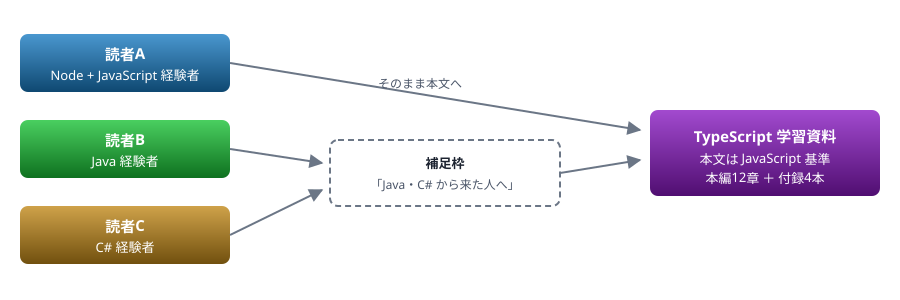
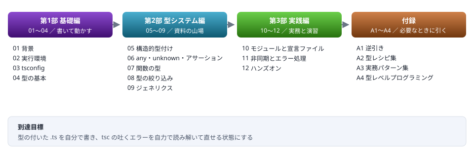

# ZZ. 資料の構成

Node+JavaScript／Java／C# のいずれかを知っている読者を対象にした、本編12章＋付録4本のカリキュラム設計

> 📅 作成: 2026-08-28 / 更新: 2026-10-10 ／ ステータス: 本編12章 ＋ 付録4本 完成

[資料トップへ戻る](../README.md)

### 目次

1. [全体方針と対象読者](#1-zz1-全体方針と対象読者)
2. [資料16本の構成とロードマップ](#2-zz2-資料16本の構成とロードマップ)
3. [基礎編（01〜04）の詳細](#3-zz3-基礎編0104の詳細)
4. [型システム編（05〜09）の詳細](#4-zz4-型システム編0509の詳細)
5. [実践編（10〜12）の詳細](#5-zz5-実践編1012の詳細)
6. [付録（A1〜A4）の詳細](#6-zz6-付録a1a4の詳細)
7. [勉強会の進行案](#7-zz7-勉強会の進行案)
8. [資料のビルドと運用](#8-zz8-資料のビルドと運用)

## 1. ZZ.1 全体方針と対象読者

### 3種類の読者を1つの資料でカバーする

この資料は読者を3種類想定します。**Node+JavaScript の開発経験がある人**、**Java を知っている人**、**C# を知っている人**です。どの読者も、変数・条件分岐・繰り返し・関数・クラスは理解している前提です。

読者ごとに資料を分けると保守が3重になるため、**本文は JavaScript 経験者向けに書き、Java・C# 経験者が引っかかる箇所だけ補足枠を添える**方式にします。TypeScript は JavaScript の上に型を足した言語であり、本文の土台を JavaScript に置くのが構造的に自然だからです。



図 1 — 資料を分けず、補足枠で3種類の読者を吸収する

> [!NOTE]
> **プログラミング未経験者は対象外とします。**
> 「変数とは」「関数とは」から始めると分量が数倍になり、経験者には冗長な資料になります。読者はすでに何らかの言語を書けるという前提を置くことで、TypeScript 固有の話に集中できます。

### 本文を書くときの5原則

| 原則 | 内容 | 理由 |
|---|---|---|
| ［原則1］ | **同じ処理の JavaScript を必ず並べる** | TypeScript は JavaScript の拡張。「JS ではこう書いていた／型を付けるとこうなる」が最も速い導線になる |
| ［原則2］ | **Java・C# 経験者が引っかかる箇所だけ補足枠を置く** | 静的型付けの経験がかえって邪魔をする場面（構造的型付け・型消去・変性）が存在する |
| ［原則3］ | **「なぜそうなっているか」を先に書く** | `strict` や `moduleResolution` は理由を知らないと必ず忘れる |
| ［原則4］ | **動かせる短いコードで終わる** | 各節の最後に `npx tsx` でそのまま実行できる5行以内の例を置く |
| ［原則5］ | **設定差・環境差はバッジで示す** | コピペして動かなかったとき、原因が設定差だと分かるようにする |

### 補足枠に書くこと・書かないこと

読者がプログラミングの基礎を持っている前提により、補足枠の中身は絞り込めます。書くのは**静的型付け言語の経験者が TypeScript で誤解する点**だけです。

| 判定 | 内容 | 例 |
|---|---|---|
| ✅ **書く** | Java・C# と仕組みが根本的に違う点 | 構造的型付け、型は実行時に消える、ジェネリクスに実行時情報がない |
| ✅ **書く** | 同名だが意味が異なる用語 | `interface`、`enum`、`readonly`、`private` |
| ✅ **書く** | JavaScript 側の前提知識 | プロトタイプ、`undefined` と `null` の使い分け、イベントループ |
| ❌ **書かない** | プログラミングの基礎概念 | 変数とは、関数とは、クラスとは、条件分岐とは |
| ❌ **書かない** | 本文の単なる繰り返し | 本文で説明済みの内容を言い換えただけの枠 |

> [!NOTE]
> **枠の見出しは「Java・C# から来た人へ」で統一します。**
> 「はじめての人へ」だと未経験者向けに読めてしまいます。補うのは**静的型付け言語との差分であって、プログラミングそのものではない**ことを見出しで示します。

### バッジの使い方

TypeScript は**同じコードでも設定と実行環境で結果が変わる**言語です。差がある箇所だけ、その場でバッジを示します。

| バッジ | 意味 | 使用例 |
|---|---|---|
| **strict** | `strict: true` のときだけエラーになる／挙動が変わる | `null` チェックの強制、暗黙の `any` の禁止、関数引数の反変チェック |
| **ESM** **CJS** | モジュール形式で書き方が変わる | `import` の拡張子指定、`__dirname` の有無、`require` との相互運用 |
| **Node型ストリップ** | Node が `.ts` を直接実行する場合の制約 | `enum`・`namespace`・パラメータプロパティが使えない |
| **TS7** | TypeScript 7 と 5 系で挙動が違う | **`strict` が既定で有効**、`@types` に `types` の明示が必要、`TS5112` |
| （なし） | どの環境でも同じ。大半の内容 | バッジを付けない |

> [!NOTE]
> **設定バッジは判定バッジと色相帯を分けます。**
> 判定バッジ（✅ **良い** ❌ **悪い** ⚠️ **警告** ⬜ **未実施** ）と同じ色を使うと、<strong>strict が「良いこと」に読めてしまいます。</strong>設定バッジは事実を示すだけで、良し悪しの評価ではありません。藍・青緑・茶・紫を割り当て、緑・赤・橙・灰とは重ならないようにします。

> [!NOTE]
> **バッジを付けすぎない。**
> どこでも動く内容にまで付けると、本当に注意が必要な箇所が埋もれます。**コピペして動かなかったときに原因が設定差だと分かる**ことが目的なので、差がある箇所に限定します。

### 1ファイルの構成テンプレート

| 位置 | 内容 | 目的 |
|---|---|---|
| 冒頭 | この章で何ができるようになるか（3行） | 読む前に到達点を示す |
| 各章 (h1) | 概念 → JavaScript との対比 → TypeScript の書き方 → 短い実例 | 既知から未知へ橋を架ける |
| 補足枠 | `.callout` で「Java・C# から来た人へ」 | 読者B・Cの補足。読者Aは飛ばせる |
| 末尾 | まとめ表 ＋ 次章への導線 | 復習と連続性 |

### 番号の付け方 — 「資料番号.章番号」で通す

資料全体で番号体系を1つに揃えます。資料 01 の中の章は `01.1`・`01.2`…、付録 A1 の中の章は `A1.1`・`A1.2`… とします。**どの番号を見ても、どの資料のどこかが一意に決まります。**

| 場所 | 表記 | 例 |
|---|---|---|
| README の資料一覧 | 資料番号 ＋ **太字のタイトル** | 01. **背景** |
| 各資料の目次 | 資料番号.章番号 ＋ **太字のタイトル** | 01.2 **TypeScript は「検査して、型を消す」だけ** |
| 各資料の見出し (h1) | 資料番号.章番号 ＋ タイトル | 01.2 TypeScript は「検査して、型を消す」だけ |
| 他の資料からの参照 | 資料番号.章番号 | 「詳細は 08.3 で扱います」 |

> [!NOTE]
> **章番号だけ CSS カウンタで自動採番します。**
> 目次の `a::before` を `content: "01." counter(tocnum)` の形にすると、**資料番号は固定文字列、章番号だけが自動採番**されます。章を増減しても番号を書き直す必要がありません。
> ただし **README の資料一覧はカウンタを使えません。**`01`〜`12` と `A1`〜`A4` で番号体系が違うためです。ここだけは直書きし、資料を増減したときに手で直します。h1 の見出しも直書きです。

### エラーメッセージの載せ方

`tsc` のエラーは**既定で英語**です。実際に出力される英語をそのまま載せ、日本語訳を添えます。

```typescript
// error TS2353: Object literal may only specify known properties,
//               and 'namae' does not exist in type 'User'.
//
// 訳: オブジェクト リテラルは既知のプロパティのみ指定できます。
//     'namae' は型 'User' に存在しません。
```

| 項目 | 方針 |
|---|---|
| 英語を先に置く | <strong>エラー番号で検索したとき、英語のほうが情報が見つかります。</strong>読者が実際に目にするのも英語です |
| 訳の出典 | `tsc --locale ja` の出力に合わせます。**独自に訳しません**（読者が日本語表示にしたとき、文言が一致します） |
| 表示形式 | `--pretty` の形式（`ファイル:行:桁 - error TSxxxx:`）に合わせます |
| 省略 | 長いメッセージは折り返して載せます。`...` で省略しません |

## 2. ZZ.2 資料16本の構成とロードマップ

### 本編12章＋付録4本を通し番号で扱う

本編と付録は**1つの連続したリスト**として並べ、目次の色も 01 から A4 まで通しで割り当てます。本編を読み終えた読者がそのまま付録へ進めること、逆引きで飛び込んだ読者が本編との位置関係を色で把握できることを狙っています。



図 2 — 3部構成と付録のロードマップ。付録は本編を読み終えた後も引き続き使う

### 資料一覧

| No. | タイトル | 扱う内容 | 色相 |
|---|---|---|---:|
| 01 | 背景 | TypeScript は何を解決したか、**型は実行時に消える**、JSDoc・Flow との違い、Java/C# のコンパイルとの決定的な差 | 280 |
| 02 | 実行環境 | `tsc`・`tsx`・Node の型ストリップ・Bun／Deno、npm と `@types`、エディタと言語サーバ | 261.3 |
| 03 | tsconfig | `strict` 系の各項目、`target`／`module`／`moduleResolution`、パス解決。**最大の詰まりどころ** | 242.7 |
| 04 | 型の基本 | プリミティブ、配列、オブジェクト型、union・リテラル型、`type` と `interface` の使い分け | 224 |
| 05 | 構造的型付け | **山場①**。名前的型付けとの違い、互換性の判定、余剰プロパティチェック | 205.3 |
| 06 | any・unknown・型アサーション | 型検査から降りる3つの方法とその代償。`any` の伝播、`as` が嘘をつく瞬間 | 186.7 |
| 07 | 関数の型 | シグネチャ、省略可能引数、オーバーロード、コールバックの型、戻り値の推論 | 168 |
| 08 | 型の絞り込み | **山場②**。`typeof`／`in`／判別可能ユニオン、型ガード関数、`never` による網羅性チェック | 149.3 |
| 09 | ジェネリクス | 制約、型引数の推論、Java／C# のジェネリクスとの違い（変性・実行時情報なし） | 130.7 |
| 10 | モジュールと宣言ファイル | ESM と CJS の相互運用（**実務で最も事故る**）、`.d.ts`、型定義のないライブラリへの対処 | 112 |
| 11 | 非同期とエラー処理 | `Promise` の型、`async`／`await`、`catch` が `unknown` である理由、例外と戻り値の使い分け | 93.3 |
| 12 | ハンズオン | 勉強会用の課題と解答例。JSON を読んで型を付け、集計して出力するまで | 74.7 |
| A1 | 逆引き | 4つの入口から本編へ引く索引 — やりたいこと／`tsc` のエラー番号／JS・Java・C# の構文／用語 | 56 |
| A2 | 型レシピ集 | **型定義の断片**。`Result` 型、型ガード関数、設定オブジェクト型、ブランド型、判別可能ユニオンの雛形 | 37.3 |
| A3 | 実務パターン集 | **動くコードのまとまり**。外部入力（JSON）の検証、環境変数、API クライアント、CLI 引数、ファイル I/O | 18.7 |
| A4 | 型レベルプログラミング | Mapped Types・Conditional Types・テンプレートリテラル型・ユーティリティ型 | 0 |

> [!NOTE]
> **付録は `A1`〜`A4` の記法にします。**
> 本編の `01`〜`12` は順に読む前提ですが、付録は**必要になったときに引く**ものです。番号体系を変えることで、読者が「順番に読まなくてよい」と判断できます。ファイル名でも `12-` の後ろに並ぶため、一覧の見た目も崩れません。

### A2 と A3 の切り分け

付録の A2 と A3 は**粒度**で分けます。同じ話題が両方に登場することがありますが、読者の入口が違います。

| 付録 | 何から引くか | 中身 | 例 |
|---|---|---|---|
| A2 | こういう**型**を書きたい | 型定義の断片。単体で完結する | `Result<T, E>` の定義、`isUser` のような型ガード関数、ブランド型 |
| A3 | こういう**処理**を書きたい | 動くコードのまとまり。そのまま貼って使える | JSON ファイルを読んで検証し、型の付いた値として返す一式 |

### 読む順序の依存関係

- **01 → 02 → 03** は順番必須。環境が整わないと以降を動かせない
- **04・05** は TypeScript の核心。ここだけは飛ばさせない
- **06〜09** は 05 に依存する。順に読むのが望ましい
- **10・11** は独立性が高く、必要な順に読んでよい
- **12** は 09 まで終わっていれば着手できる

> [!NOTE]
> **05「構造的型付け」と 08「型の絞り込み」が本資料の2つの山場です。**
> 05 は Java・C# 経験者が最もつまずく箇所、08 は JavaScript 経験者が最もつまずく箇所です。読者によって難所が違うため、どちらも時間を厚く取ります。

### README の構成 — 目次までを1画面に収める

README を開いた読者の目的は**読むことではなく、目的の資料へ移動すること**です。案内や約束事を先に長く置くと、リンクにたどり着く前に読者が疲れます。**読者への案内は2〜3行に留め、すぐ目次を出します。**

| 位置 | 内容 | 分量と方針 |
|---|---|---|
| 1 | タイトルバー | 資料名と日付のみ |
| 2 | 読者への案内 | **2〜3行。**「誰向けか」と「何ができるようになるか」だけ。読者が自分向けの資料かを判断できれば足りる |
| 3 | **目次（16本）** | 通し色のバッジ。**ここまでを1画面に収める** |
| 4 | この資料の約束事 | バッジの意味、補足枠の見出し、コードの前提（バージョン・実行方法・文字コード） |
| 5 | 読み方 | 順に読む場合と、目的から引く場合の2通り |
| 6 | 勉強会で使う場合 | 5回の割り当て表のみ。詳細はこの構成案へリンク |

> [!NOTE]
> **説明は目次より後ろに置きます。**
> 順に読む読者は目次を飛ばして下へ進み、目的の資料を探しに来た読者は目次で離脱します。**どちらの読者も損をしない順序**がこれです。逆にすると、後者が毎回同じ説明をスクロールで飛ばすことになります。

### README には資料作成向けの情報を書かない

README は**読者だけのためのページ**です。資料を作る側・運用する側の情報は README に置かず、この構成案に集めます。

| README に書かないもの | 置き場所 | README での扱い |
|---|---|---|
| HTML が原本であること、Markdown の生成手順 | この構成案 ZZ.8 | 書かない |
| 設計方針・執筆原則・章立ての意図 | この構成案 ZZ.1〜ZZ.6 | 書かない |
| 勉強会の時間配分・進行（主催側） | この構成案 ZZ.7 | 5回の割り当て表と、参加者の事前準備だけを書く |
| ディレクトリ構成・ビルド手順・文字コード規則 | この構成案 ZZ.8 | 書かない（読者が書くコードの文字コードだけは約束事に書く） |
| 構成案の中身（対象読者・章立ての意図・執筆方針） | この構成案 | **リンクだけを「この資料について」に置く** |

> [!NOTE]
> **構成案は公開しますが、読む前提にはしません。**
> この構成案は読者にも見せる資料として `docs/ZZ-構成.html` に置いています。ただし<strong>読まなくても本編は読めます。</strong>README では「この資料について」の中にリンクを1つ置くだけにし、<strong>目次（資料一覧）には並べません。</strong>本編・付録と同じ列に置くと、読むべきものだと受け取られるためです。

### 同じ説明を2か所に書かない

README・各資料・この構成案で内容が重複すると、<strong>片方だけ直して食い違います。</strong>項目ごとに「どこに書くか」を1か所に決め、他の場所では繰り返しません。

| 内容 | 書く場所 | 他の場所での扱い |
|---|---|---|
| 対象読者・前提知識 | README の案内 | 各資料では繰り返さない |
| 各資料が何を扱うか | README の目次 | 各資料の冒頭には**到達点**（この章で何ができるようになるか）を書く。扱う内容の再掲はしない |
| バッジの意味 | README の約束事 | 各資料では使うだけ。凡例を再掲しない |
| 環境構築の手順 | 02 実行環境 | README はリンクのみ。手順を書かない |
| 勉強会の進行 | この構成案 | README は5回の割り当て表のみ |
| 執筆方針・原則 | この構成案 | README・各資料には書かない |
| 用語の定義 | 初出の資料 | 以降の資料は初出章へリンクする |

## 3. ZZ.3 基礎編（01〜04）の詳細

### 01. 背景

「なぜ型を書くのか」ではなく、<strong>「TypeScript の型がどういう立場のものか」</strong>を最初に据えます。ここを誤解したまま進むと、後の章がすべて歪みます。

- JavaScript の何が問題だったか — 実行するまで壊れていることが分からない
- **型は実行時に消える** — `tsc` は型を検査して、型を消した JavaScript を出力するだけ
- Java・C# のコンパイルとの決定的な違い — 型情報が実行時に残らない、型エラーがあっても出力はできる
- JSDoc・Flow という選択肢との比較

### 02. 実行環境

- `tsc` — 検査して出力する。`--noEmit` で検査だけにもできる
- `tsx`／`ts-node` — その場で実行する
- **Node の型ストリップ** — Node が `.ts` を直接実行できるようになった経緯と制約
- Bun・Deno — 標準で `.ts` を扱える処理系
- npm と `@types` — 型定義がどこから来るのか

### 03. tsconfig

**読者が最も詰まる章**です。設定項目を網羅列挙するのではなく、「この設定が無いと何が起きるか」の順で並べます。

- `strict` — なぜ既定で有効にすべきか。内訳の各項目が何を防ぐか
- `target`／`lib` — 出力する構文のレベルと、使える標準 API
- `module`／`moduleResolution` — **ESM と CJS の分岐点**
- `paths`・`baseUrl` — 便利だが実行時には効かないことの説明

### 04. 型の基本

- プリミティブ、配列、タプル、オブジェクト型
- union 型とリテラル型 — **Java・C# に無い、TypeScript で最もよく使う道具**
- `type` と `interface` の使い分け
- `null`／`undefined` と省略可能プロパティ

## 4. ZZ.4 型システム編（05〜09）の詳細

### 05. 構造的型付け

<strong>山場①。</strong>Java・C# 経験者にとって最も違和感のある部分です。「同じ形なら同じ型として通る」という判定基準を、通る例と通らない例の両方で示します。

- 名前ではなく形で判定する — `implements` を書かなくても互換になる
- 余剰プロパティチェック — オブジェクトリテラルを直接渡したときだけ厳しくなる理由
- 意図的に区別したいときのブランド型

### 06. any・unknown・型アサーション

型検査から降りる3つの方法と、それぞれの代償を扱います。**実務で型が壊れる原因のほとんどがここ**です。

- `any` — 伝播する。1か所の `any` が下流の検査をすべて無効化する
- `unknown` — 安全な受け口。使う前に絞り込みを強制する
- `as` による型アサーション — 検査を黙らせるだけで、値は変わらない
- `!`（非 null アサーション）を使ってよい場面・いけない場面

### 07. 関数の型

- 引数と戻り値の型、戻り値の型を書くべき場面・省くべき場面
- 省略可能引数とデフォルト値
- オーバーロード — Java・C# のそれとは仕組みが違う
- コールバックの型と、引数の数が合わなくても通る理由

### 08. 型の絞り込み

<strong>山場②。</strong>TypeScript を「書ける」から「使える」に変える章です。

- `typeof`／`instanceof`／`in` による絞り込み
- **判別可能ユニオン** — 実務で最も使う設計パターン
- 型ガード関数（`x is T`）
- `never` による網羅性チェック — `switch` の漏れをコンパイル時に検出する

### 09. ジェネリクス

- 型引数の基本と `extends` による制約
- 推論が効く場面・効かない場面
- Java・C# のジェネリクスとの違い — **実行時に型引数の情報が残らない**
- 変性（共変・反変）に触れる範囲を限定する

## 5. ZZ.5 実践編（10〜12）の詳細

### 10. モジュールと宣言ファイル

**実務で最も事故が多い領域**です。型の話というより、Node のモジュール解決の話が中心になります。

- `import`／`export` と、型だけを import する `import type`
- **ESM と CJS の相互運用** — `"type": "module"`、拡張子、`default` の食い違い
- `.d.ts` が何をしているか
- 型定義が無いライブラリへの対処 — `@types` を探す、自分で書く、諦めて `unknown` で受ける

### 11. 非同期とエラー処理

- `Promise<T>` と `async`／`await` の型
- **`catch` の変数が `unknown` である理由** — Java・C# の `catch (Exception e)` との違い
- 例外で投げるか、戻り値で返すか（`Result` 型との対比）
- 並行実行と型 — `Promise.all` のタプル推論

### 12. ハンズオン

勉強会の最終回に対応します。課題は**1本の実用スクリプト**に絞り、それを段階的に完成させる形にします。

- 課題 — JSON ファイルを読み込み、型を付けて検証し、集計して出力する
- 段階1: `any` のまま動かす → 段階2: 型を付ける → 段階3: 検証を入れる → 段階4: エラー処理を足す
- 詰まりやすい箇所の解説と解答例

> [!NOTE]
> **ハンズオンは「型を後から付ける」順序で進めます。**
> 実務で TypeScript を導入する場面は、既存の JavaScript に型を足す形が大半です。最初から完成形の型を書かせるより、`any` を潰していく過程を体験させるほうが実務に近くなります。

## 6. ZZ.6 付録（A1〜A4）の詳細

### 本編との役割の違い

本編は**読んで理解するもの**、付録は**手を動かしている最中に引くもの**です。付録は通読を前提にせず、どこから開いても意味が通るように書きます。

### A1. 逆引き — 4つの入口

| 入口 | 読者の状況 | 例 |
|---|---|---|
| やりたいこと | 書きたい処理は決まっている | 「オブジェクトの一部だけ省略可能にしたい」 |
| **エラー番号** | `tsc` のエラーが読めない | `TS2322`／`TS2345`／`TS7006`／`TS2339` |
| 他言語の構文 | JS・Java・C# での書き方は知っている | 「Java の `Optional` に相当するものは」 |
| 用語 | 言葉の意味が分からない | 「判別可能ユニオン」「型消去」「変性」 |

> [!NOTE]
> **エラー番号からの入口が、PowerShell 資料の逆引きとの最大の違いです。**
> TypeScript のエラーメッセージは長く、番号でしか検索できない場面が多くあります。頻出のエラー番号を実際のメッセージ全文とともに載せ、原因と修正を対にします。

### A2. 型レシピ集

型定義の断片を集めます。`Result` 型、型ガード関数、設定オブジェクト型、ブランド型、判別可能ユニオンの雛形、部分更新用の型など。**1レシピは20行以内**に収め、使いどころと落とし穴を1〜2行添えます。

### A3. 実務パターン集

そのまま貼って使えるコードのまとまりを集めます。A2 との違いは**粒度**で、こちらは「処理として完結していること」を条件にします。

- 外部入力（JSON）を読んで検証し、型の付いた値として返す
- 環境変数を型付きで読む
- API クライアントの型付け
- CLI 引数の解析
- ファイル I/O とエラー処理

### A4. 型レベルプログラミング

ライブラリの型定義を読むために必要な道具立てを扱います。**「書けなくても読めればよい」という線引きを冒頭で明示**し、実務で書く必要が出る範囲だけ深掘りします。

- 組み込みユーティリティ型（`Partial`・`Pick`・`Omit`・`Record` ほか）
- Mapped Types
- Conditional Types と `infer`
- テンプレートリテラル型

## 7. ZZ.7 勉強会の進行案

### 全5回・1回90分

| 回 | 範囲 | ねらい | 難度 |
|---|---|---|---|
| 第1回 | 01〜03 | 環境を動かす。全員が `tsc` の通る状態を作る | ✅ **低** |
| 第2回 | 04〜06 | 型を書く。`any` に逃げない習慣をつける | ⚠️ **中** |
| 第3回 | 07〜08 | <strong>山場。</strong>絞り込みと網羅性チェック | ❌ **高** |
| 第4回 | 09〜11 | ジェネリクスとモジュール。実務の事故を潰す | ❌ **高** |
| 第5回 | 12 | ハンズオン | ⚠️ **中** |

### 1回あたりの時間配分

| 時間 | 内容 |
|---|---|
| 10分 | 前回の振り返りと質問 |
| 50分 | 資料の読み合わせ。要所で手を止めて各自実行 |
| 25分 | その回の演習 |
| 5分 | 次回範囲の予告 |

### 事前準備（参加者）

- Node.js の LTS を入れておく
- `npx tsx --version` が通る状態にしておく
- エディタ（VS Code 想定）で `.ts` を開き、型エラーが波線で出ることを確認しておく

> [!NOTE]
> **第1回の冒頭で環境構築に時間を溶かさないことを最優先にします。**
> PowerShell 資料の勉強会でも同じ問題が起きます。参加者の環境が揃っていないと、その回の内容に入る前に時間が尽きます。事前準備の3点は**必須条件**として案内します。

## 8. ZZ.8 資料のビルドと運用

### HTML が原本

各資料は HTML と Markdown の両方を用意し、**HTML を原本**とします。内容を直すときは HTML を編集し、そのあと変換スクリプトで `.md` を作り直します。Markdown を直接編集しません。

### ディレクトリ構成

```text
typescript-learn/
├─ index.html              README.html へのリダイレクト
├─ README.html             原本（目次・約束事・逆引き入口）
├─ README.md               生成物
├─ docs\                   公開資料（読者に配るもの）
│   ├─ 01-背景.html 〜 12-ハンズオン.html
│   ├─ A1-逆引き.html 〜 A4-型レベルプログラミング.html
│   ├─ ZZ-構成.html         このファイル
│   ├─ *.md                生成物
│   ├─ images\             切り出した SVG（Markdown 生成時に作る）
│   └─ samples\            動作確認済みサンプル（.ts）
├─ etc\c.bat
└─ tmp\
```

### サンプルコードの文字コード

| 対象 | 文字コード | 改行 | 理由 |
|---|---|---|---|
| `.ts`／`.json` | UTF-8（BOM なし） | LF | Node・`tsc` の既定。BOM があると設定ファイルの解析に失敗する場合がある |
| `.cmd`／`.bat` | SJIS（CP932） | CRLF | UTF-8 で保存すると日本語が化けて構文エラーになる |
| `.ps1` | BOM 付き UTF-8 | CRLF | BOM が無いと Windows PowerShell 5.1 で日本語が壊れる |

### サンプルコードは実際に動かしてから載せる

資料に載せるコードと<strong>出力の両方を、実際に動かした結果から貼ります。</strong>記憶や推測で書きません。

| 場所 | 用途 | git |
|---|---|---|
| `tmp\` | 検証用の使い捨てプロジェクト。`npm init` と `node_modules` はここに置く | 管理外 |
| `docs\samples\` | 動作確認が済んだサンプル。資料から参照する | 管理対象 |

```shell
# 検証用プロジェクトの作り方
cd tmp
npm init -y
npm i -D typescript tsx

npx tsc --version          # バージョンを実測する
npx tsc --noEmit ファイル名.ts   # 型エラーの実物を得る
npx tsx ファイル名.ts            # 実行結果の実物を得る
```

> [!IMPORTANT]
> **バージョンは必ず実測します。**
> この構成案を書いた時点では TypeScript 5.x 系を想定していましたが、<strong>実際の環境は 7.0.2 でした。</strong>想定と実機は食い違います。**動作確認環境は README に明記**し、実測した値を書きます。
> どの版の組み合わせで検証したかは、下の「検証の履歴」に残します。実行環境は **Node.js 26 系**を対象とします。

### 検証の履歴

新しい検証を上に足します。過去の行は書き換えません。全コード例の型検査は `tools/40_test/verify-versions.ts` で行い、版ごとのエラーの差を出します。

| 日付 | TypeScript | Node.js | npm | 対象 | 結果 |
|---|---|---|---|---|---|
| 2026-10-10 | 7.0.2 ・ 6.0.3 | 26.10.0 | 11.19.1 | 全資料のコード例 177 本の型検査、`docs\samples\` の実行 | ⚠️ 差 2 種。union の並び順（7.0.2 は `"age" \| "name"`、6.0.3 は `"name" \| "age"`。09 章を 7.0.2 の出力に直した）と、未定義名への候補の提示（7.0.2 は `TS2552`、6.0.3 は `TS2304`。断片のコードだけで、本文には出ない） |
| 2026-08-29 | 7.0.2 ・ 5.9.3 | 26.8.1 | 11.19.0 | 全資料 | ✅ エラーメッセージ・`--pretty` の表示形式・出力される JavaScript に差なし |

> [!WARNING]
> **検証で出たエラーが、書いたコードのものとは限りません。**
> 検証中、**プロジェクトの親ディレクトリにある `node_modules\@types\node` を `tsc` が拾い**、無関係な型定義エラーが6件出ました。TypeScript のバージョン差だと誤認しかけましたが、原因は環境でした。**自分のファイル名が行頭にないエラーは、まず環境を疑います。**

> [!NOTE]
> **この資料は `.ts` と `.cmd` で文字コードの規則が逆になります。**
> サンプルを動かす `.cmd` ランチャーと、その中身の `.ts` が別の規則になるため、**どちらのファイルを編集しているか**を常に意識する必要があります。02 の章でこの点に触れます。

### Markdown の生成と検証

- インライン SVG は `docs\images\` に切り出し、`` で参照する（GitHub がインライン SVG を除去するため）
- 日本語の `**` 強調が効かない箇所は `<strong>` に置換する。判定は変換スクリプト側で機械的に行う
- 生成後、リンク切れと `**` の残りを機械的に検査する

### 資料をコピーして次の資料を作るときに書き換える箇所

既存の資料（例: `01-背景.html`）をコピーして `02` を作る場合、**書き換え忘れると前の資料の情報が残る箇所**があります。特に下の2つは、見た目が崩れないため気づきません。

| 箇所 | 書き換える内容（01 → 02 の例） | 見落としやすさ |
|---|---|---|
| `<title>` | `01 背景 —` → `02 実行環境 —` | ✅ **低** |
| タイトルバー | h1 と lead の文言 | ✅ **低** |
| **目次の資料番号** | CSS の `content: "01." counter(tocnum)` → `"02."` | ❌ **高** |
| 章見出しの番号 | `01.1`〜 → `02.1`〜 | ⚠️ **中** |
| `.chNN` の色相 | 章数が変われば全章を再計算（刻み ＝ 280 ÷（章数 − 1）） | ⚠️ **中** |
| **SVG の `<defs>` id** | `g-01-1a` → `g-02-1a` | ❌ **高** |
| 次章への導線 | 末尾のリンク先 | ⚠️ **中** |

> [!WARNING]
> **この2つは CSS と SVG の中にあるため、本文を読み返しても見つかりません。**
> 目次の資料番号を直し忘れると、02 の目次が `01.1`〜と表示されます。<strong>本文の見出しは `02.1` なので、目次と本文で番号が食い違います。</strong>SVG の id は、重複しても片方の図が正しく表示されることがあり、崩れて初めて気づきます。**機械的に確認します。**

```powershell
# 目次の資料番号がファイル名の番号と一致しているか
Select-String -Path docs\*.html -Pattern 'content: "([0-9A]\w)\." counter'

# SVG の defs id に、そのファイルの番号が入っているか
Select-String -Path docs\*.html -Pattern '<(?:linearGradient|marker|clipPath|filter) id="([^"]+)"'
```

### 章を増減したときの手順

- 資料を1本増減したら、**16本の通し色相を新しい本数で計算し直す**（刻み ＝ 280 ÷（本数 − 1））
- README の目次バッジと、この構成案の資料一覧を同じ値に揃える
- 各資料の中の章（h1）の色相は、そのファイル内の章数で別途計算する

[資料トップへ戻る](../README.md)
